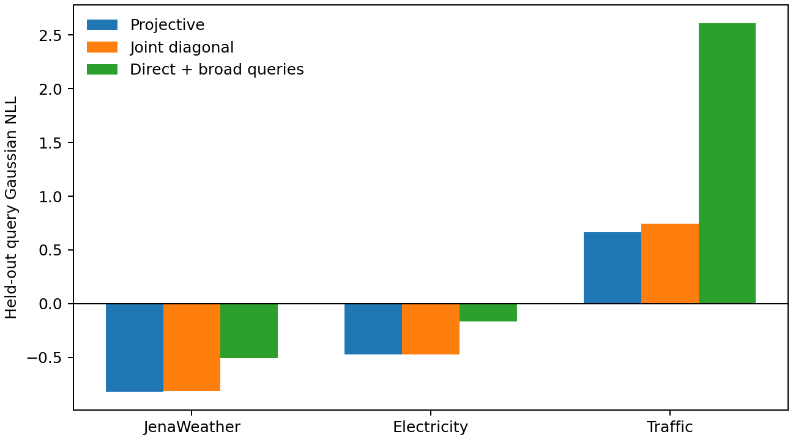
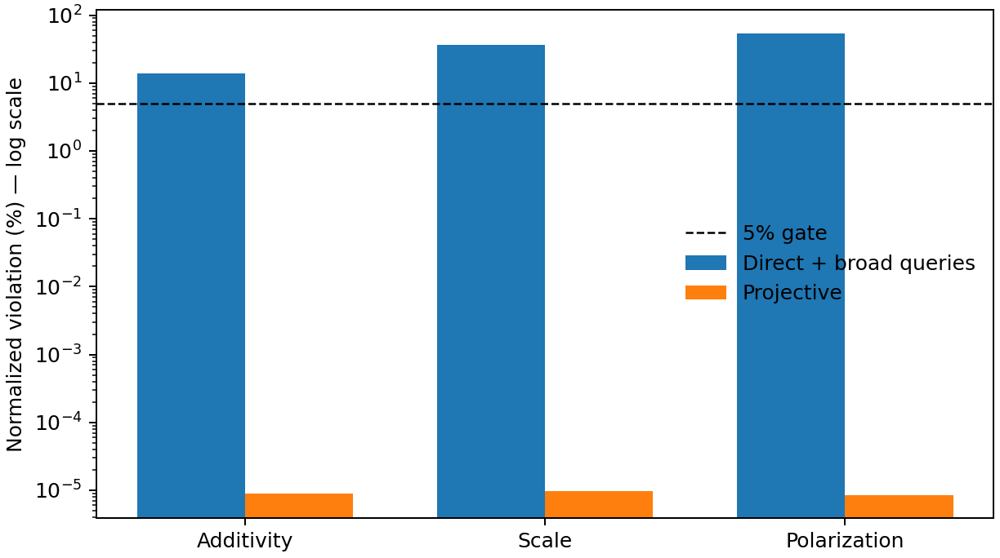
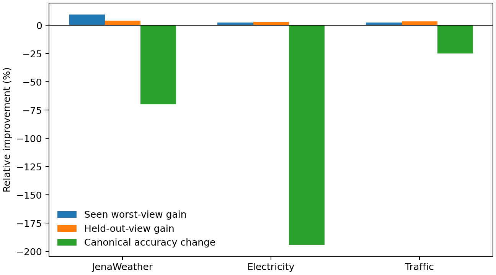

# Projective and view follow-up results

Protocol SHA-256: `831ca4517303c86bde13d4211b6b2dc33f1a59e6e60933805713b078e9c299ee`. The primary protocol was frozen before either outcome; the adversarial projective addendum was frozen before its control outcomes.

| Rank | Direction | Primary gate | Decision |
|---:|---|:---:|---|
| 1 | Projectively consistent temporal queries | PASS | **Scale narrowly** |
| 2 | Learned consistency across lossless views | FAIL | **Stop this method** |

## Projective consistency: survives real data and stronger controls

The primary study passed every gate on Jena Weather, Electricity, and Traffic:

- ProjectiveNet won held-out NLL in 9/9 cells against the parameter-matched direct QueryNet.
- Its maximum algebraic violation was below `1.1e-7` on every dataset; direct QueryNet exceeded 5% on all three identities and datasets.
- Mean interval-coverage error was 5.5% versus 35.6%.
- The original direct model was not simply untrained: on familiar query types it achieved reasonable NLL on Jena Weather and Electricity, then failed on held-out compositions. See `query_family_audit.csv`.

The stronger direct model was explicitly trained on difference, dense, and scaled query families. ProjectiveNet still won 9/9 NLL cells; its calibration error was only 0.7 percentage points worse. Broad-query training also left mean contradictions of 13.9% additivity, 36.8% scale, and 54.4% polarization.

Mean NLL by dataset:

| Dataset | Projective | Joint diagonal | Direct + broad queries |
|---|---:|---:|---:|
| Jena Weather | -0.820 | -0.814 | -0.506 |
| Electricity | -0.474 | -0.471 | -0.169 |
| Traffic | 0.666 | 0.747 | 2.612 |

### Claim boundary

The full low-rank covariance beat the diagonal joint model in only 5/9 cells, below the frozen 6/9 threshold. Therefore the evidence supports **exact joint-to-query consistency and compositional generalization**, but not a claim that modeling cross-coordinate covariance is responsible for the gain.

## View consistency: robustness is purchased by losing the task

The consistency penalty reduced prediction dispersion versus augmentation by 12.4% on Jena Weather, 10.7% on Electricity, and 5.0% on Traffic. But none of the frozen usefulness gates passed:

| Dataset | Worst seen-view gain | Held-out-view gain | Canonical degradation | Held-out gap to oracle |
|---|---:|---:|---:|---:|
| Jena Weather | 9.6% | 4.3% | 70.0% | 138.0% |
| Electricity | 2.3% | 3.2% | 194.2% | 353.3% |
| Traffic | 2.3% | 3.3% | 25.0% | 131.2% |

The result is consistent with an identifiability problem: without the view map, generic invariance removes predictive coordinate structure. Keep representation sensitivity as a diagnostic phenomenon, but stop this view-agnostic consistency method. A future revival would need schema/view metadata or paired calibration data and would be a materially different formulation.

## Recommended paper-scale allocation

Scale only the projective direction. The defensible thesis is: **forecasting systems that expose many marginal or aggregate queries should derive them from one coherent joint predictive object, because direct query conditioning can be accurate on familiar queries yet contradict itself and fail compositionally.**

The next experiment should broaden datasets, horizons, query languages, and strong joint-distribution baselines while retaining the direct broad-query control and the diagonal-joint ablation. Do not build the paper around low-rank covariance unless a later test establishes a robust advantage.

## Integrity

- Primary wall times: projective 218.4s; view 195.0s. Control wall time: 201.9s.
- Audited finite rows: projective 18, adversarial controls 18, query-family diagnostics 72, view cells 252, dispersion 36.
- Maximum view round-trip error: 2.86e-06.
- Scripts compile, all expected outputs exist, and no training process remains active.
