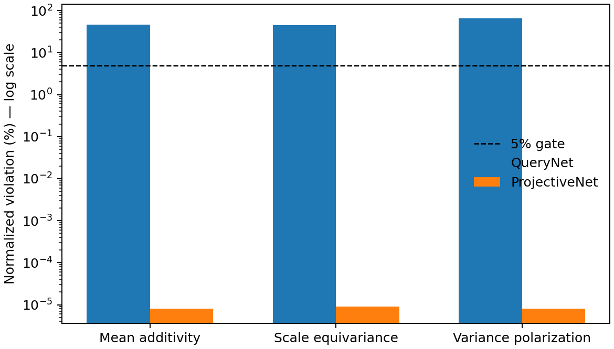
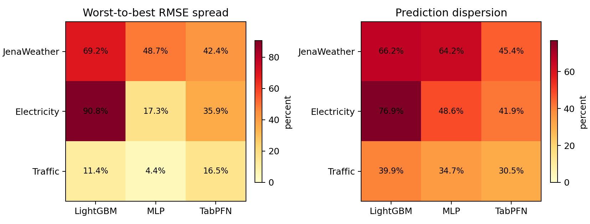
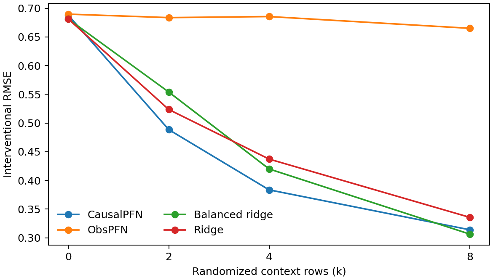

# Oral-ceiling pilot results

Protocol SHA-256: `538f14851b6a1cf54737c3b9bc8df3cf3b227c1b33cf2ef53469f261317b3164`. All decisions below use the frozen gates in [PROTOCOL.md](PROTOCOL.md); the three runs finished below their 30-minute caps.

| Rank | Direction | Gate | Decision | Wall time |
|---:|---|:---:|---|---:|
| 1 | Projectively consistent query distributions | PASS | **Continue** | 155.8s |
| 2 | View-consistent longitudinal learning | PASS | **Continue** | 69.1s |
| 3 | Interventional temporal-table pretraining | FAIL | **Reformulate** | 272.0s |

## 1. Projective consistency — strongest signal

- QueryNet violated all three algebraic identities above the 5% gate: mean additivity 46.3%, scale equivariance 44.6%, and variance polarization 64.9%.
- ProjectiveNet's worst mean violation was 9.14e-08, effectively numerical zero.
- The constraint did not trade away predictive quality: ProjectiveNet won held-out NLL in 3/3 seeds, averaging -0.579 versus 0.648.
- **Next falsifier:** test calibrated joint/marginal distributions on real multivariate forecasting benchmarks and compare against covariance-capable forecasters. The present evidence is synthetic mechanism evidence only.

## 2. View consistency — strong real-data phenomenon

- 8/9 dataset-model pairs crossed both 10% thresholds; all three model families and all three datasets are represented.
- Median worst-to-best RMSE spread was 35.9%, and median cross-view prediction dispersion was 45.4% of canonical RMSE.
- The winning model changed across equivalent views on Jena Weather, Electricity, and Traffic (3/3 datasets).
- Round-trip reconstruction error was at most 1.91e-06, so information loss does not explain the effect.
- **Next falsifier:** train an explicitly view-consistent objective and require lower worst-view regret on unseen invertible transformations without reducing canonical-view accuracy.

## 3. Interventional pretraining — control failure

- At `k=4`, CausalPFN reduced RMSE 44.1% versus ObsPFN but only 8.7% versus the better ridge baseline; it beat both in 26.0% of environments.
- At `k=8`, it reduced RMSE 52.8% versus ObsPFN but was 2.5% worse than the better ridge baseline; it beat both in 24.9% of environments.
- This is not a green light for scaling. A defensible reformulation must introduce a genuinely nonlinear/high-dimensional identification problem and still retain strong semiparametric or doubly robust controls.

## Integrity notes

- Raw row counts: view 108, projective 6, interventional aggregate 48, interventional per-environment 3072. All numeric outputs are finite.
- The first ProjectiveNet run is deliberately retained in `projective_invalid_postprojection_floor/`. Its post-projection constant variance floor violated scale equivariance by construction. [PROJECTIVE_IMPLEMENTATION_NOTE.md](PROJECTIVE_IMPLEMENTATION_NOTE.md) records the correction; no seed, data, model, step, metric, or threshold changed.
- These are preliminary mechanism screens, not evidence for an oral-level paper by themselves.
