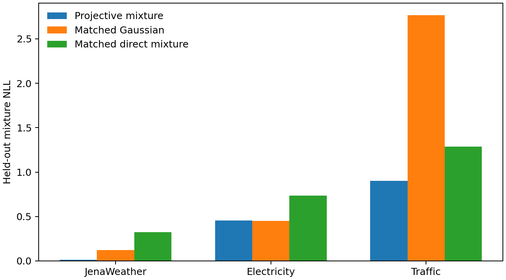
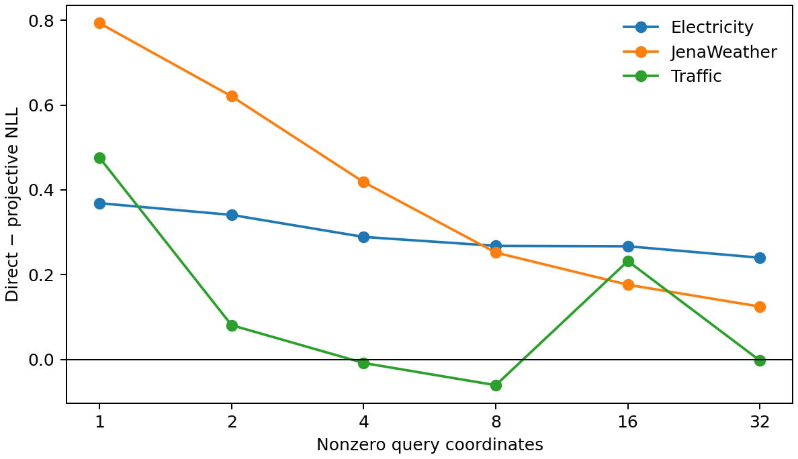
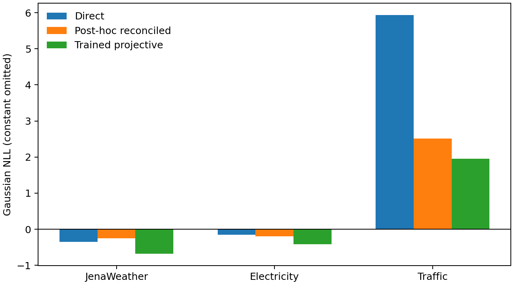

# Projective novelty-pilot results

Primary protocol SHA-256: `b5148cca2610c49d8cca287d123d81427cc2daa1874150ca16056159d8b3daab`. All primary gates were frozen before outcomes. The mixture capacity addendum was frozen after the primary mixture pass and before its control outcomes.

| Rank | Component | Gate | Decision |
|---:|---|:---:|---|
| 1 | Non-Gaussian projective mixture | PASS + capacity control PASS | **Continue** |
| 2 | Black-box projective reconciliation | FAIL | **Stop** |
| 3 | Query support-size complexity law | FAIL | **Reject hypothesis** |

## 1. Non-Gaussian projective mixture — survives

A four-component conditional joint mixture retains analytic linear projections and exact moment identities while representing non-Gaussian predictive shapes.

- Primary comparison: 8/9 NLL wins over the single projective Gaussian and 9/9 over the direct scalar mixture.
- Capacity-matched comparison: 8/9 wins over the 135,989-parameter Gaussian and 9/9 over the 137,211-parameter direct mixture; the projective mixture has 136,580 parameters.
- NLL improvement over the matched Gaussian: Jena Weather 0.108, Electricity -0.004, Traffic 1.865.
- Maximum projective identity violation: 1.69e-06.
- PIT calibration error: 3.1%, only 0.4 percentage points worse than the better comparator.

Capacity-matched mean NLL:

| Dataset | Projective mixture | Matched Gaussian | Matched direct mixture |
|---|---:|---:|---:|
| Jena Weather | 0.014 | 0.122 | 0.326 |
| Electricity | 0.453 | 0.450 | 0.736 |
| Traffic | 0.902 | 2.766 | 1.285 |

**Interpretation:** non-Gaussianity adds real probabilistic value on Jena Weather and Traffic, not merely capacity. Electricity is effectively tied. This component merits a larger comparison against existing consistent non-Gaussian forecasters.

## 2. Query-complexity law — falsified

Direct-minus-projective NLL regret did not grow with support size. Spearman correlations were -1.00 on Jena Weather, -1.00 on Electricity, and -0.37 on Traffic.

The direct model's largest weakness is not composing many coordinates. It is respecting algebraic transformations—especially sign, scale, and variance relations—that are unevenly covered in training. Do not claim a monotone “complexity gap.” A future benchmark should cross query-family transformations rather than use support size as its central axis.

## 3. Black-box reconciliation — unreliable

- It improved NLL on two datasets, but closed at least 50% of the trained-projective gap only on Traffic (85.9%).
- It closed 16.5% on Electricity and worsened Jena Weather.
- Reconstructed covariance matrices required a mean 66.7% relative correction to become PSD.
- Coverage remained within the gate on only one dataset.

**Interpretation:** the Gaussian representability identity is useful theory and a diagnostic, but querying and repairing an inconsistent black box is not a reliable method. Consistency needs to be architectural or trained end-to-end.

## Updated novelty verdict

Only one proposed 4+/5 component survived: **a non-Gaussian joint mixture that provides exact, analytic distributions for arbitrary linear temporal queries and outperforms capacity-matched Gaussian and direct-query mixtures.**

This is promising but not yet a standalone ICLR claim because consistent mixture forecasting already has close prior work. The next decisive test is a paper-scale comparison against marginalization-consistent flows and hierarchical coherent forecasters, emphasizing the distinction between arbitrary signed/scaled linear queries and subset or fixed-hierarchy marginals.

## Integrity

- Finite audited rows: query metrics 108, query regrets 54, mixture 27, capacity controls 18, reconciliation 27, reconstruction diagnostics 9.
- Primary mixture wall time: 362.4s; capacity controls: 223.6s.
- All scripts compile, protocol hashes match, expected outputs exist, and no training process remains active.
