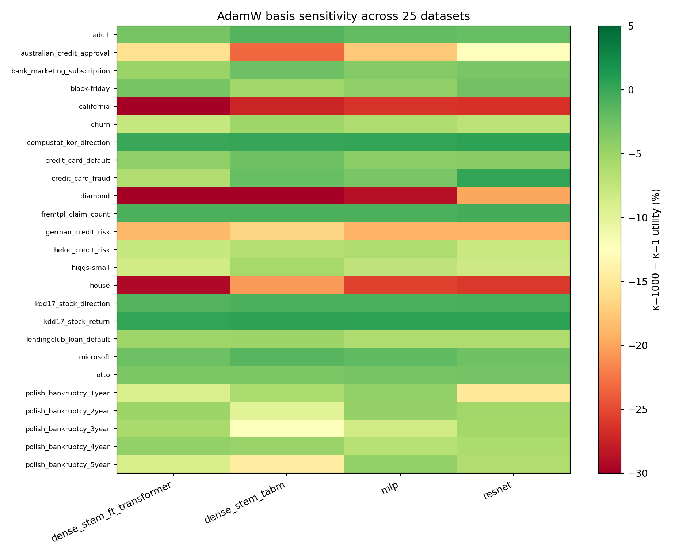
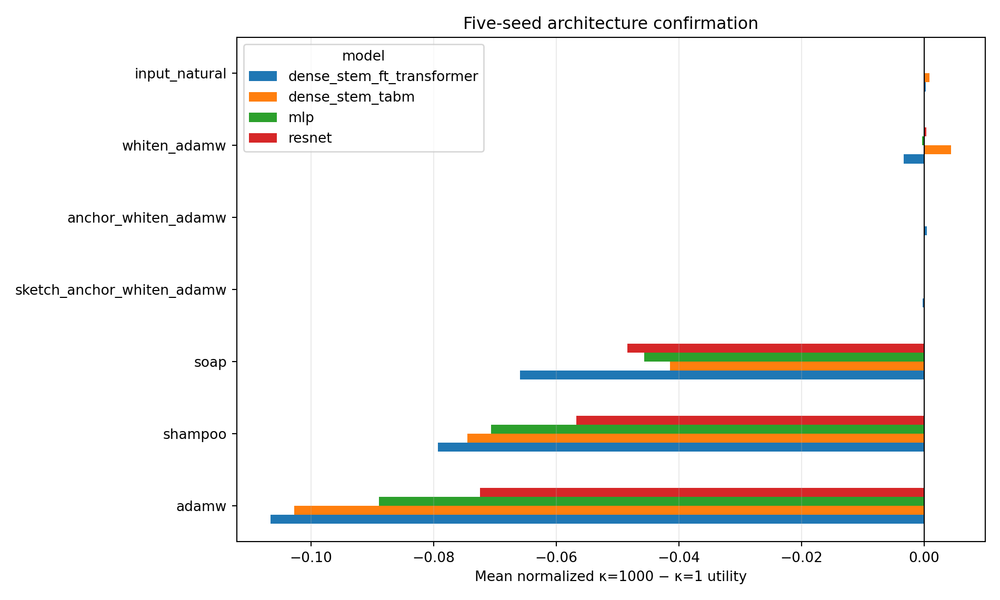

# Day 3 broad benchmark report

## Executive result

There is a strong and broad **controlled** signal. Across 30 tabular datasets,
four neural architectures, and three paired seeds, changing only the condition
of an exactly invertible input basis from `κ=1` to `κ=1000` harmed ordinary
AdamW in 336 of 360 comparisons (93.3%). The mean normalized utility change was
`-0.08395`, with a dataset/model clustered bootstrap interval of
`[-0.09928, -0.06942]`.

This does not mean that every natural choice of tabular encoding has a large
effect. The exact natural cumulative/local pair differed by only 0.38% in median absolute
normalized performance, and ordinary strong preprocessing choices were also
small and not systematically ordered. The controlled intervention establishes
an optimizer vulnerability; it does not establish that this vulnerability is
always a dominant real-world error source.

Three methods passed the frozen confirmation gate: exact anchor
canonicalization, its progressive sketch implementation, and the first-layer
input-natural optimizer. The first two are canonical input parameterizations,
not new optimizers. The third is a practical approximation to established
natural-gradient/K-FAC invariance, not a new invariance theorem.

## 1. What the experiment changed

For each training representation, the benchmark constructs two descriptions of
the same rows:

`X_1000 = X_1 B`,

where `B` is invertible. Thus no feature information is added or removed, and a
network with an affine first layer can represent exactly the same functions in
either description. The transform controls global energy while changing its
condition number from 1 to 1000. Splits, labels, model size, training budget,
and paired random seed are held fixed.

The reported sensitivity is a normalized utility difference. Larger utility is
always better: classification uses its primary score, while regression negates
RMSE before normalization. Negative sensitivity therefore means the badly
conditioned basis performed worse.

### Condition number in plain language

Imagine a round cloud of points. A reversible coordinate change can turn it
into a long, thin ellipse without losing a single point. The condition number
`κ` is the longest stretch divided by the shortest stretch. At `κ=1`, directions
have similar scale. At `κ=1000`, one direction is 1,000 times more stretched
than another.

Optimization then resembles walking through a long, narrow valley. A step that
is safe across the narrow direction may be very slow along the long direction.
Adam rescales coordinates one at a time, but an arbitrary basis also rotates and
mixes them. A diagonal rescaler cannot generally undo that coupling.

## 2. Protocol and audit trail

The main prospective benchmark was frozen before its outcomes and contains 25
datasets, four models, three seeds, and the two κ endpoints: 2,400 completed
Phase-1 cells with no failures. Its aggregate freeze digest is
`7e5482daa38e13b8b4c1880e937a82c4246b95ce8ddd7a167a096b3493981441`.

A separate five-dataset prospective replication was frozen after the original
Phase-1 outcomes, but before any extension model outcomes. It adds Covtype,
Jannis, Gesture, Santander, and Facebook Comments. All 120 cells completed with
no failures; its freeze digest is
`58ed19b7c12e1d24524f6f9e5e1acd160e7f65715da5310a23aff7f916fd60af`.
The 25- and 5-dataset stages must not be described as one jointly preregistered
30-dataset experiment.

The main completion audit also covers 2,800 five-seed confirmation cells and
504 rank/ridge robustness cells. The analyzer excludes learning-curve CSVs,
requires complete selection coverage, counts missing cells as failures, and
uses dataset/model clustering rather than treating seeds as independent
datasets. These corrections are recorded in `analysis_fix_addendum.json`.

## 3. Thirty-dataset controlled result

The original 25-dataset screen found mean normalized sensitivity `-0.08241`, a
median of `-0.05211`, and a 92% harmful fraction. Its clustered interval was
`[-0.10990, -0.06796]`.

The untouched five-dataset replication was stronger: all 60 dataset/model/seed
comparisons were harmful, with mean sensitivity `-0.09166` and interval
`[-0.10559, -0.07822]`.

Combined results are:

| Architecture | Mean sensitivity | Harmful fraction |
| --- | ---: | ---: |
| FT-Transformer dense stem | -0.09063 | 94.4% |
| TabM dense stem | -0.08521 | 91.1% |
| MLP | -0.08222 | 95.6% |
| ResNet | -0.07776 | 92.2% |
| **All** | **-0.08395** | **93.3%** |

The combined clustered interval excludes zero, and the paired Wilcoxon
probability is approximately `6.2e-21`. The effect therefore survives model family, task, and
dataset variation; it is not an isolated MLP example.

## 4. Remedy screen and five-seed confirmation

The Phase-1 MLP screen compared AdamW, diagonal scaling, whitening, exact and
sketched anchor canonicalization, a first-layer input-natural update, practical
first-layer K-FAC, Shampoo, and SOAP.

| Method | Phase-1 mean sensitivity | Phase-1 reduction vs AdamW | Interpretation |
| --- | ---: | ---: | --- |
| AdamW | -0.08241 | 0% | Baseline vulnerability |
| Diagonal AdamW | -0.07742 | -0.92% | Cannot undo rotations/coupling |
| Shampoo | -0.07307 | -10.66% | Full-model implementation did not close the gap |
| SOAP | -0.05931 | 6.27% | Small paired improvement |
| First-layer K-FAC | -0.03126 | 39.30% | Helpful, but damping/approximation matter |
| Whitening + AdamW | -0.00087 | 86.55% | Strong screen result |
| Input-natural first layer | +0.000004 | about 100% | Near-invariant in aggregate |
| Progressive sketch anchor | +0.000047 | about 100% | Canonical closure |
| Exact anchor canonicalization | approximately 0 | 100% | Exact canonical closure |

The stricter confirmation used ten datasets, all four architectures, five seeds,
and both κ endpoints. A method had to remove at least 80% of paired sensitivity,
lose at most 1% at `κ=1` on average, and introduce no excess failure rate.

| Method | Confirmation sensitivity reduction | Mean clean-basis loss | Frozen gate |
| --- | ---: | ---: | --- |
| Exact anchor canonicalization | 99.81% | 0.20% | Pass |
| Progressive sketch anchor | 99.43% | 0.21% | Pass |
| Input-natural first layer | 99.69% | 1.00% | Pass, narrowly |
| Whitening + AdamW | 56.84% | 0.46% | Fail |
| SOAP | 36.06% | 0.40% | Fail |
| Shampoo | -13.23% | 0.28% | Fail |

Whitening's aggregate mean was near zero, but its per-pair reduction was only
56.8%; small and tail-sensitive cases exposed unresolved orthogonal ambiguity.
The input-natural method passed on aggregate, but its clean-basis TabM loss was
2.63%, so it is not uniformly free even though the overall loss was just under
the 1% threshold. Shampoo retained mean sensitivity `-0.07032` and was harmful
in 86% of confirmed pairs. Shampoo and SOAP are not automatically affine
invariant in these finite, damped, grafted implementations.

## 5. How invariant canonicalization works

Canonicalization gives every invertible description of the same training table
the same internal coordinates.

1. Center the training matrix and determine its retained rank `r`.
2. Select `r` deterministic anchor rows using only the column space of the
   matrix.
3. Express every row as coefficients relative to those anchor rows.
4. Whiten or normalize the coefficient table and reuse the train-fitted map on
   validation and test rows.

If the original table is `X` and its anchor matrix is `R`, each row satisfies
`X = C R` for a coefficient matrix `C`. After any invertible recoding `B`, the
table and anchors become `XB` and `RB`, but

`XB = C(RB)`.

The coefficients `C` do not change. The network therefore receives the same
canonical coordinates, so the artificial κ difference disappears.

A simple analogy is describing locations by their coefficients relative to the
same set of landmarks. Rotating or stretching the map also rotates or stretches
the landmarks; the landmark coefficients stay the same.

This is a diagnostic and parameterization, not a newly invented general idea.
It can be expensive, depends on the training sample, and is discontinuous when
rank or pivot ordering changes. General canonicalization also has known
continuity limitations.

### Exact versus progressive sketch implementation

The exact implementation was numerically stable on the Adult audit: anchor sets
were identical and coordinate discrepancies were around `2.4e-13`. The sketch
implementation reconstructs the full matrix accurately but is not guaranteed
to choose identical pivots near a numerical tie. In the audit, two anchors
changed and test-coordinate relative discrepancy reached 0.304 before
post-whitening differences. It is therefore empirically effective, but should
not be called algebraically exact in floating-point arithmetic.

The current sketch was also slower to fit than the full transform on this
benchmark. It is a progressive memory/row-subset construction, not established
evidence of better scalability.

## 6. Natural encodings and strong preprocessing

The benchmark includes exact, naturally named cumulative-Helmert and
local-adjacent encodings of the same numerical/categorical feature spaces on 25
datasets, for MLP and ResNet with three seeds. Across 150 paired cells, local
minus cumulative had mean normalized
difference `+0.00126`; the median difference was nearly zero and the median
absolute difference was 0.00380. The dataset-clustered interval included zero.

For numerical preprocessing, raw standardized minus PLE had mean normalized
difference `-0.01443`; quantile standardized minus PLE had mean `+0.00322`.
Typical absolute differences were about 1.4%, and the clustered intervals
included zero.

These results matter for interpretation. The controlled κ manipulation reveals
large capacity for failure, but ordinary natural encodings in this suite did
not produce a comparably universal ranking. The phenomenon is real; its typical
deployment importance remains conditional.

## 7. Rank deficiency and ridge damping

The robustness experiment duplicated 0%, 25%, or 50% of columns on four
datasets and evaluated AdamW, both anchor methods, and input-natural damping at
`1e-10`, `1e-8`, `1e-6`, and `1e-4`. All 504 runs completed without a recorded
failure.

That does not mean every setting was stable. With duplicated columns, the
input-natural preconditioner condition reached roughly `1e10` at ridge `1e-10`,
and Microsoft performance became erratic. Ridges around `1e-8` to `1e-6` were
substantially safer, while `1e-4` could over-damp useful directions. Exact and
sketched anchor methods retained near-unit transformed condition and near-zero
basis sensitivity across duplicate fractions.

The practical lesson is that a pseudoinverse or damped natural metric needs an
explicit numerical policy. “No NaNs” is weaker than “robust predictive
behavior.”

## 8. Distribution shift

Three time-indexed finance tasks were evaluated with their official
chronological/purged split and with a fixed random-row split. This was a
separately frozen same-table comparison with 18 completed cells and no failures.

Under chronological deployment, mean sensitivity was effectively zero
(`+0.000007`), with a dataset-bootstrap interval spanning
`[-0.00811, +0.00504]`. Under the random split it was `-0.01109`, with interval
`[-0.02343, -0.00150]`; the random split was more harmful in all nine paired
comparisons.

Temporal shift did not amplify the basis effect here; it mostly removed it.
This is a limitation, not evidence that random splitting is preferable. The
random split is easier and may mix entities or adjacent dates, whereas the
official split better represents deployment.

## 9. Runtime and memory

On the Phase-1 MLP screen, mean training time was 2.88 seconds for AdamW.
Relative training times were approximately 1.03× for whitening, 1.11× for both
anchor variants, 1.13× for first-layer K-FAC, 1.17× for SOAP, 1.47× for the
input-natural method, and 2.12× for Shampoo.

Mean transform-fit time was about 0.056 seconds for whitening, 1.85 seconds for
the exact anchor, and 2.56 seconds for the sketch anchor. These timings measure
the remedy transform, not construction of the underlying base representation.
They are benchmark-specific and do not establish asymptotic scalability.

Observed peak training allocations were similar for input transforms (roughly
84--87 MiB on the MLP screen), with modest extra optimizer state for K-FAC,
natural, SOAP, and Shampoo. Invalid peak-memory observations are omitted and
their valid counts are reported rather than silently imputed.

## 10. Theory and prior-art boundary

For a first affine layer `h = Wu`, an input recoding `u' = Tu` represents the
same function with `W' = WT^{-1}`. Ordinary gradients do not transform in the
way required to keep finite updates matched. Multiplying the first-layer
gradient on the right by the inverse input second moment does:

`Delta W = -eta G E[uu^T]^{-1}`.

This is the input-side natural-gradient/K-FAC geometry. Idealized K-FAC's affine
invariance is established prior art. Natural gradient, whitening, Shampoo,
SOAP, and canonicalization in general are also prior art. Decoupled AdamW
weight decay itself commutes with the linear parameter map; an explicit
Euclidean L2 penalty does not.

Grinsztajn et al. already studied feature rotations and argued that tabular
learners benefit from preserving feature orientation. Consequently, “tabular
networks care about coordinates” is not a novel claim. The narrower potential
advance here is the combination of energy-controlled condition-number
interventions, exact cross-schema orbit verification, paired canonical closure,
a modern 30-dataset/four-model audit, and practical cost/rank/shift evaluation.

See `THEORY_DAY3.md` and `RELATED_WORK_DAY3.md` for the proof and citations.

## 11. Limitations

- The strongest effect is induced by controlled `κ=1000` transformations;
  natural encoding differences are much smaller and not systematically ranked.
- Only five datasets form the post-original prospective replication; the full
  30 were not jointly frozen before any broad outcome was known.
- Confirmation covers ten datasets rather than all 30.
- Temporal deployment tasks did not reproduce the broad random-split effect.
- Hyperparameters were held fixed to isolate geometry; per-basis retuning could
  reduce the practical gap, but would itself be extra cost caused by coordinates.
- The anchor map is sample-dependent, costly for wide data, and numerically
  discontinuous at rank/pivot boundaries.
- The input-natural method narrowly passes the average clean-loss gate and is
  weaker for TabM.
- No new invariant optimizer or general canonicalization theorem is established.

## 12. Final ICLR verdict

This is a systematic empirical phenomenon. It is not a new invariant optimizer.

The evidence is sufficient for a serious ICLR submission about a **systematic
empirical phenomenon**, provided it is framed precisely. It is not enough for a
paper whose claim is a new invariant optimizer, a new canonicalization idea, or
the first observation that feature coordinates matter.

The strongest defensible paper is: modern tabular neural networks show broad,
causally isolated finite-training sensitivity within exactly equivalent
representation orbits; known invariance principles close the gap in ideal or
canonical form, while practical approximations have measurable accuracy,
stability, and compute tradeoffs.

My honest assessment is **ICLR-plausible but borderline, not a slam dunk**.
Thirty datasets, four backbones, prospective replication, exact equivalence
checks, and remedy closure make the empirical case substantial. Prior rotation
work, the absence of new method theory, small natural-encoding effects, and the
null temporal-shift result materially weaken novelty and impact. The submission
has a credible path if it foregrounds the causal benchmark and exact closure,
states the prior-art boundary unusually clearly, and avoids overselling the
canonicalizer as the contribution.

## 13. Reproduction artifacts

- Protocols: `BROAD_BENCHMARK_PROTOCOL.md` and
  `BROAD_BENCHMARK_PROTOCOL_ADDENDUM.md`
- Main/confirmation/robustness audit: `results/day3/broad_benchmark/completion_audit.json`
- Five-dataset audit: `results/day3/broad_benchmark/extension_completion_audit.json`
- Thirty-dataset summary: `results/day3/broad_benchmark/combined_30_summary.json`
- Distribution-shift audit: `results/day3/broad_benchmark/distribution_shift_completion_audit.json`
- Canonicalization numerical audit: `SKETCH_CANONICALIZATION_AUDIT.md`
- Machine-readable seven-requirement audit:
  `results/day3/broad_benchmark/day3_goal_completion_audit.json`
