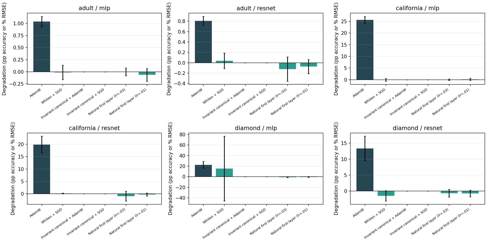

# Day 3 follow-up — optimizer remedies for basis sensitivity

## Plain-language result

Yes, there was a strong signal.

We changed only the coordinates used to describe the inputs. The information
and the functions representable by the network stayed the same. Nevertheless,
ordinary AdamW became substantially worse when those coordinates were badly
conditioned:

- Adult: about **1.0 accuracy point** worse for the MLP and **0.8 point** worse
  for the ResNet.
- California Housing: test RMSE became **25.7% worse** for the MLP and **19.9%
  worse** for the ResNet.
- Diamond: test RMSE became **22.5% worse** for the MLP and **13.3% worse** for
  the ResNet.

This is not a loss of input information. It is an optimization failure caused
by how the same information is stretched and mixed across coordinates.

### What is a condition number?

Imagine that the feature cloud is a circle. An invertible coordinate change can
turn it into an ellipse without adding or deleting any points. The condition
number, κ, is roughly

`longest stretch / shortest stretch`.

At κ=1, all directions have comparable scale. At κ=3000, one direction is
3,000 times more stretched than another. Learning then resembles walking down a
very long, narrow valley: a step size that is safe across the narrow direction
can be painfully slow along the long direction, while a step large enough for
the long direction can overshoot the narrow one.

Adam rescales individual coordinates, but an arbitrary invertible basis change
also *mixes* coordinates. A diagonal correction cannot generally undo this
rotation and coupling. That explains why diagonal AdamW helped but did not
solve the problem.

## What was tested

The screen compared 18 variants on Adult classification and Diamond regression
at κ in `{1, 3000}`, with two paired seeds. It covered:

- AdamW, Adam without weight decay, AdaGrad, and momentum SGD;
- diagonal standardization and full whitening;
- invariant anchor-coordinate canonicalization, with and without whitening;
- inverse-square-root covariance gradient preconditioning;
- a natural-gradient first layer with several learning rates and initialization
  rules;
- a function-matched initialization diagnostic.

All input transforms were fit on training rows only. The transformed input was
verified to satisfy `X_κ = X_reference B` to floating-point precision, with `B`
invertible. The predictor architecture, splits, early stopping protocol, and
seed pairing were held fixed.

The strongest practical candidates were then confirmed with five paired seeds
on all six dataset/model pairs:

- Adult, California Housing, and Diamond;
- MLP and ResNet;
- κ=1 and κ=3000.

That confirmation comprises 360 trained runs. The initial 18-remedy screen
comprised 144 attempted runs; four high-κ Diamond runs using ordinary SGD or
the all-SGD natural variant diverged and were recorded as failures.

## Confirmed results

Positive sensitivity means performance became worse from κ=1 to κ=3000.
Adult sensitivity is in accuracy percentage points; regression sensitivity is
the percent increase in RMSE. “Baseline gain” compares κ=1 performance with
ordinary AdamW; positive is better.

| Dataset / model | AdamW sensitivity [95% CI] | invariant canonical + AdamW [95% CI] | its κ=1 gain | natural first layer [95% CI] | its κ=1 gain |
| --- | ---: | ---: | ---: | ---: | ---: |
| Adult / MLP | +1.039 [0.932, 1.146] pp | 0.000 [0.000, 0.000] pp | −0.034 pp | −0.002 [−0.083, 0.078] pp | −0.119 pp |
| Adult / ResNet | +0.808 [0.722, 0.895] pp | 0.000 [0.000, 0.000] pp | −0.151 pp | −0.120 [−0.354, 0.114] pp | −0.274 pp |
| California / MLP | +25.654 [24.132, 27.177]% | 0.000 [0.000, 0.000]% | +3.579% | −0.015 [−0.310, 0.280]% | +3.274% |
| California / ResNet | +19.871 [16.493, 23.250]% | 0.000 [0.000, 0.000]% | +2.934% | −0.920 [−2.882, 1.043]% | +0.676% |
| Diamond / MLP | +22.528 [16.107, 28.948]% | +0.000004 [−0.000003, 0.000011]% | +3.250% | −0.793 [−1.504, −0.082]% | +3.122% |
| Diamond / ResNet | +13.334 [9.491, 17.176]% | −0.00000006 [−0.000012, 0.000012]% | +0.992% | −0.689 [−1.913, 0.534]% | −0.184% |

The table reports paired-seed means and paired 95% t intervals. Means, standard
deviations, and intervals for both sensitivity and κ=1 baseline performance are
in `confirmation_summary.csv`.

Tiny negative sensitivities mean κ=3000 happened to perform slightly better;
they should be read as “no harmful condition-number effect,” not as evidence
that bad conditioning helps.

## The two remedies

### 1. Invariant canonical first-layer coordinates — exact remedy

The training feature matrix is first expressed relative to a deterministic set
of anchor rows selected from its column space, then whitened. If `X` is replaced
by `XB` for any invertible `B`, the resulting anchor coefficients are the same.
Thus κ=1 and κ=3000 present effectively identical coordinates to the network.

This removed sensitivity in all six confirmations to numerical precision. It
also preserved the κ=1 baseline: the two Adult changes were only −0.034 and
−0.151 accuracy points, while all four regression cases improved or essentially
matched AdamW.

This is the most reliable engineering remedy found. It can be represented as a
fixed training-data-derived first linear map, but it is more accurately called
an invariant parameterization or canonicalization than a pure optimizer
change. It is also a constructive proof that the original degradation came
from arbitrary coordinates rather than missing information.

### 2. Natural-gradient first layer — near-invariant optimizer remedy

For the first affine layer, the gradient was multiplied by

`E[[x, 1][x, 1]^T]^{-1}`,

the inverse second moment of the augmented training input. Ordinary AdamW was
retained for all later layers. Initialization was also sampled in a whitened
function-space metric. This is important: a natural-gradient update paired with
ordinary parameter-space initialization was still strongly basis-sensitive.

This optimizer-level remedy reduced the harmful κ effect to at most about 0.12
accuracy point on Adult and 0.92% RMSE on regression, and every measured mean
sensitivity was zero or slightly negative. It generally preserved κ=1 quality,
with small Adult costs, improvements on California and Diamond MLP, and a tiny
Diamond ResNet cost.

It is not exactly invariant here because later layers still use AdamW,
mini-batches and early stopping introduce small trajectory differences, and
finite-precision covariance inversion needs an eigenvalue floor. Still, it is
the cleanest evidence that optimizer geometry is the mechanism.

## What did not work reliably

- Removing weight decay did not remove sensitivity, so weight decay alone was
  not the cause.
- AdaGrad and ordinary momentum SGD were worse; SGD diverged on high-κ Diamond.
- Diagonal rescaling helped, especially on Diamond, but could not undo mixed
  directions.
- Full whitening helped substantially, but whitening is unique only up to an
  orthogonal rotation. `whiten + SGD` had unstable Diamond MLP seeds. The
  invariant anchor alignment removed that remaining ambiguity.
- An inverse-square-root covariance update was not enough; the full inverse
  metric and compatible initialization were needed.
- Natural-gradient updates with ordinary initialization were poor. Update
  invariance and initialization invariance must be handled together.

The function-matched initialization diagnostic, which uses the known inverse
basis map, produced matching κ=1 and κ=3000 results. That is a diagnostic rather
than a deployable method, because a real user generally does not know a hidden
reference basis.

## Scientific verdict

The Day 3 mechanism survives the remedy test:

> Exact, information-preserving basis changes can create large test-performance
> losses under standard optimizers. A basis-invariant canonical parameterization
> removes the losses exactly, and a covariance-aware natural-gradient first
> layer nearly removes them without changing the inputs.

The most defensible method claim is therefore not “whitening always improves
tabular networks.” It is narrower: **first-layer optimization and
initialization should be defined in an input-covariance metric, or the input
space should be mapped to a deterministic invariant coordinate system.**

These are strong controlled results, not yet a broad benchmark claim. The
anchor construction can be expensive for very wide or nearly rank-deficient
data, and the experiments cover three datasets and two architectures. The next
gate should test the natural first-layer method and a scalable canonical
approximation prospectively across the untouched multi-dataset benchmark.

## Reproduction and artifacts

- Implementation: `experiments/day3/optimizer_remedies.py`
- Analysis: `experiments/day3/analyze_optimizer_remedies.py`
- Five-seed summary: `results/day3/optimizer_remedies/confirmation_summary.csv`
- Paired seed results: `results/day3/optimizer_remedies/confirmation_paired.csv`
- Raw runs and learning curves: `results/day3/optimizer_remedies/`
- Figures: `results/day3/optimizer_remedies/figures/`

The exact commands used for the screen, confirmations, and analysis are listed
in `README.md`.

## Broad-benchmark update

The three-dataset remedy result was subsequently tested in the final broad Day
3 benchmark. The controlled AdamW effect replicated across 30 distinct
datasets and four architectures: κ=1000 was harmful in 336 of 360 paired
dataset/model/seed comparisons, with mean normalized sensitivity −0.08395 and
a dataset/model clustered interval of [−0.09928, −0.06942]. The separately
frozen five-dataset extension was harmful in all 60 comparisons.

In the stricter ten-dataset, four-model, five-seed confirmation, exact anchor
canonicalization removed 99.81% of paired sensitivity with 0.20% mean clean
loss; the progressive sketch removed 99.43% with 0.21% clean loss; and the
input-natural method removed 99.69% with 1.00% clean loss. The natural method's
TabM clean loss was 2.63%, so the aggregate pass is not a uniformly free method
result. Whitening removed only 56.84% by the frozen paired criterion, and SOAP
removed 36.06%; both failed the 80% gate. Shampoo also failed.

The rank stress test exposed an additional caveat: duplicated columns made an
input-natural ridge of `1e-10` numerically erratic on Microsoft, despite no
recorded NaN or crash. Ridges around `1e-8` to `1e-6` were safer. Exact and
sketched anchor coordinates stayed near unit condition and near-zero basis
sensitivity, but the sketch can change pivots at floating-point ties and was
not faster to fit in this benchmark.

The theorem and method language also require a correction to any earlier broad
reading: ideal input-natural/K-FAC affine invariance is established prior art,
and decoupled AdamW weight decay commutes with the linear parameter map. The
new candidate contribution is the systematic tabular orbit benchmark and
finite-method audit, not the invention of invariant optimization. See
`BROAD_BENCHMARK_REPORT.md`, `THEORY_DAY3.md`, and `RELATED_WORK_DAY3.md`.
