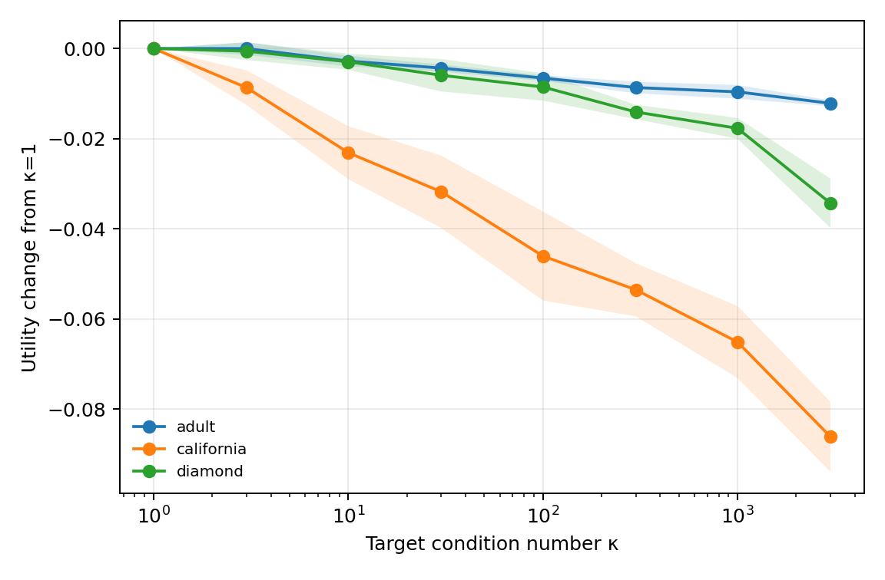
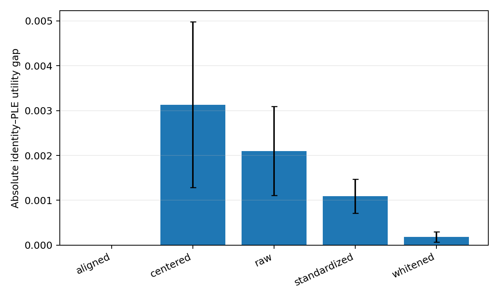
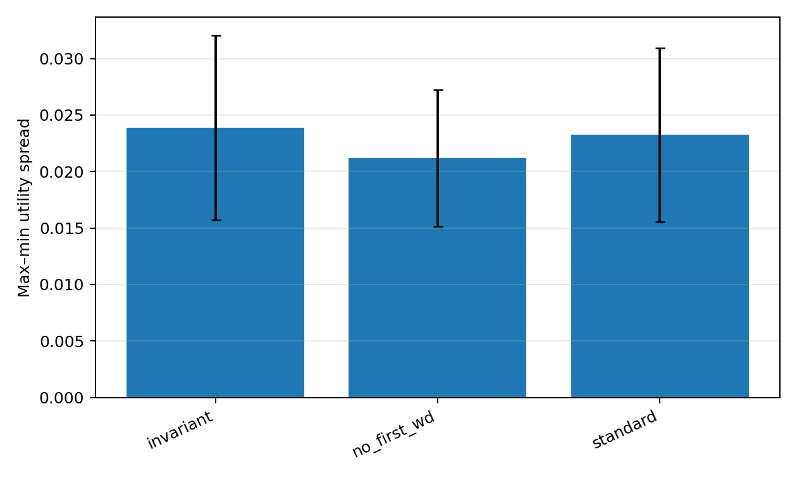
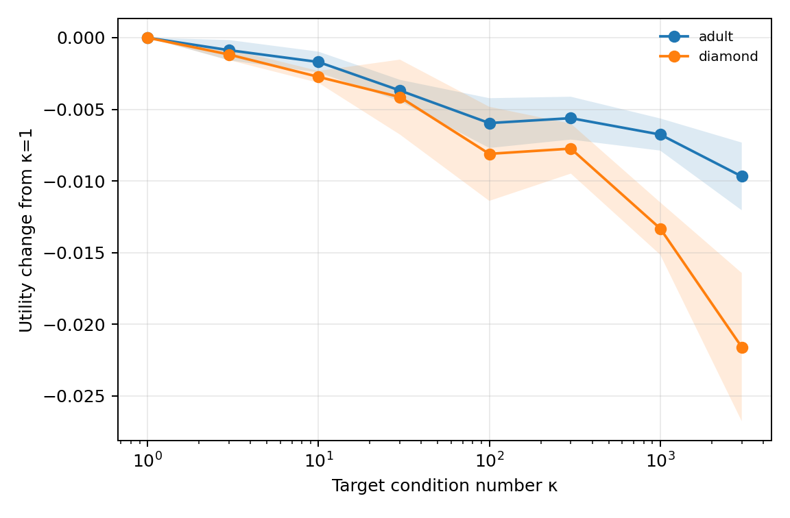
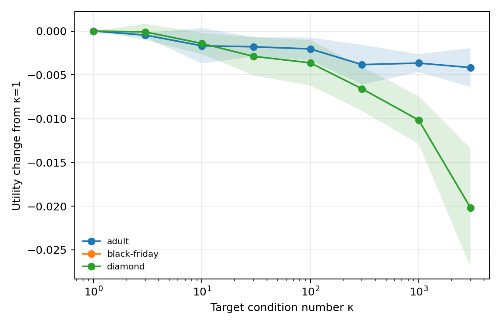
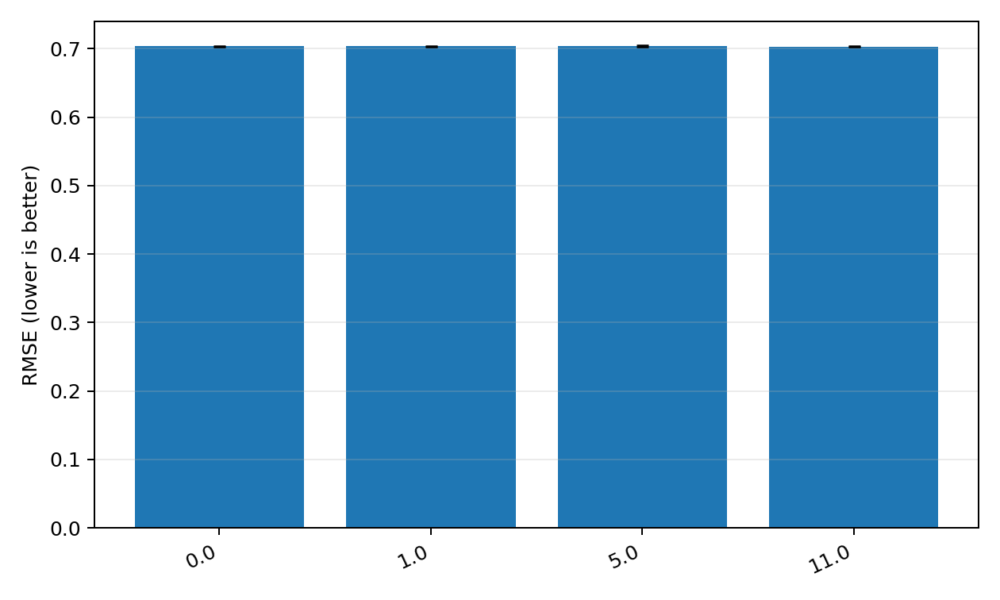
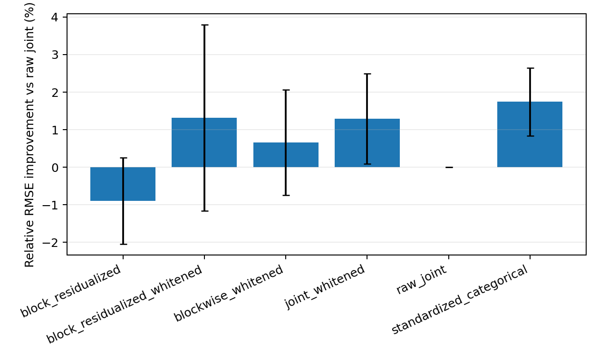
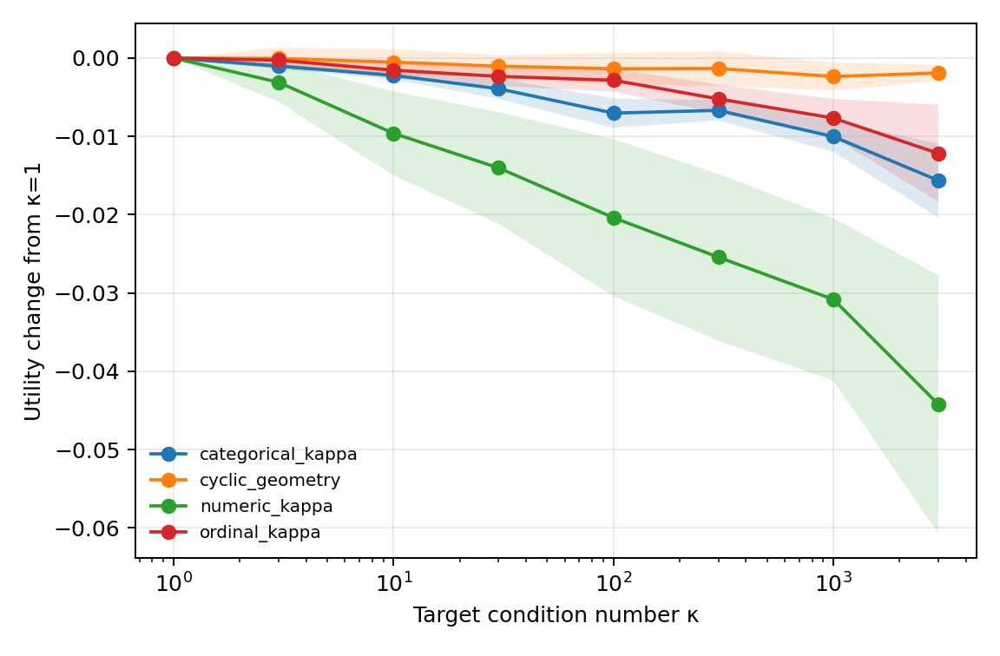

# Day 3 — Basis Geometry and Categorical Conditioning

> **Post-benchmark mechanism update:** the preregistered function-matched
> trajectory extension found that coordinate-dependent initialization explains
> about 95% of the κ=3000 fixed-budget harm, while matched AdamW still diverges
> after one update. Early drift did not pass its held-out-dataset prediction
> gate, and undamped input-natural closure failed on Adult's rank-deficient
> natural representation. See `TRAJECTORY_DECOMPOSITION_REPORT.md`.

> **Final status:** the original 771-run mechanism study was followed by a
> frozen 25-dataset benchmark, a separately frozen five-dataset prospective
> replication, 2,800 five-seed remedy-confirmation cells, rank/ridge and
> distribution-shift audits, and compute measurements. See the
> [broad benchmark report](BROAD_BENCHMARK_REPORT.md) for the final evidence and
> ICLR verdict. Sections below preserve the original study record.

## Executive verdict

**The ICLR thesis is materially stronger, but the remedy story is incomplete.** Across numerical PLE blocks, nominal categorical contrasts, and genuine ordinal state spaces, deliberately increasing condition number under exact, invertible, geometric-mean-scale-controlled basis changes caused monotone losses on the main MLP screen and replicated at the endpoints with ResNet. Adult's exact PLE/identity gap shrank by 91% after whitening and vanished after aligned canonicalization. However, the proposed function-space penalty did not reduce basis sensitivity, natural ordinal whitening was not uniformly beneficial, and exact numerical–categorical residualization did not help Diamonds by itself. The defensible paper is therefore a causal schema/basis-sensitivity paper with canonicalization as evidence—not yet a solved invariant-optimization paper.

## 1. Reproduction of Day-2 anchors

Before writing Day 3 code, I reran the frozen Adult MLP/64-bin Day 2 anchor on the official split and seed 0. It reproduced bit-for-bit:

| Representation | Day 2 test accuracy | Day 3 rerun |
| --- | ---: | ---: |
| cumulative PLE | 0.859038 | 0.859038 |
| local PLE | 0.858608 | 0.858608 |
| validation-selected blend | 0.859714 | 0.859714 |

The rerun is saved in `results/day3_anchor_reproduction.csv`. The official split fingerprints, environment, package versions, and baseline git hash are saved in `results/day3/environment.json` and `results/day3/structured_feature_audit.csv`.

The frozen Day 2 prospective tier remains named in `experiments/day3/configs/preregistered.json`: Wine Quality, Miami Housing, Food Delivery Time, Seismic Bumps, HELOC, and Credit Card Default. Their TabArena arrays/loaders are not present in this workspace's released TabPack data, so I did not replace them with favorable datasets or claim a prospective breadth result. Day 3 uses the available Adult, Black Friday, California, and Diamond anchors plus a synthetic cyclic integrity fixture.

## 2. Controlled numerical equivalent-basis sweep

### Setup

For each numerical PLE block, the training matrix was centered, restricted only to its numerical full-rank subspace, and whitened in float64. A fixed random invertible transform with target κ in `{1, 3, 10, 30, 100, 300, 1000, 3000}` was then applied blockwise. Singular values had geometric mean one, so κ changed anisotropy rather than global scale. Validation/test used only the train-fitted transform. Fixed Day 2 MLP hyperparameters were used for five paired seeds; κ=`{1,1000}` was repeated with ResNet for three seeds.

### Geometry verification

The realized transform condition numbers match their targets numerically, rank is retained, and all transforms are invertible. The κ=1 condition is a random orthogonal control rather than a privileged coordinate identity. Tests also verify the exact global-scale constraint.

### Results

| Dataset/model | κ endpoint | κ=1 metric | endpoint metric | Paired change (95% CI) |
| --- | ---: | ---: | ---: | ---: |
| Adult / MLP | 3000 | 0.85755 acc. | 0.84539 | −1.216 pp [−1.308, −1.124] |
| California / MLP | 3000 | 0.50037 RMSE | 0.58653 | +17.2%; absolute +0.0862 [0.0752, 0.0972] |
| Diamond / MLP | 3000 | 0.14815 RMSE | 0.18248 | +23.2%; absolute +0.0343 [0.0266, 0.0421] |
| Adult / ResNet | 1000 | 0.85560 acc. | 0.84782 | −0.778 pp [−1.155, −0.401] |
| California / ResNet | 1000 | 0.50812 RMSE | 0.56763 | +11.7% |
| Diamond / ResNet | 1000 | 0.15138 RMSE | 0.16825 | +11.1% |

For every dataset/model group, mean utility has Spearman ρ = −1 against log10 κ (the MLP groups use all eight points). Adult's mean best-validation epoch rose from 3.6 at κ=1 to 10.0 at κ=3000; convergence-epoch behavior was less uniform on the regression tasks, so the strongest claim is predictive degradation rather than a universal epoch-count law.

### Verdict

**H1 supported. CORE.** This is causal evidence: information, dimension, transform determinant scale, split, model budget, and hyperparameters are held fixed while anisotropy changes deliberately.

## 3. PLE vs identity whitening/canonicalization

### Equivalence tests

Adult columns 3 and 4 (capital gain/loss) have 116 and 88 training levels. PLE and the state-local Helmert identity basis have centered ranks 115 and 87. To avoid the prior unseen-value fallback confound, the local coordinates use their exact affine extension between observed states. Bidirectional relative reconstruction errors are `1.1e-14`–`3.1e-14` on train, validation, and test; maximum principal angles are about `1e-9` degrees. Full diagnostics are in `results/day3/ple_identity_equivalence_exact.json`.

### Results

The raw identity basis was better than PLE by `0.210 ± 0.113` accuracy points across five paired seeds. After diagonal standardization the signed gap was −0.0037 pp; after whitening it was −0.0012 pp with a 0.024 pp standard deviation. The mean absolute gap fell from 0.210 pp to 0.018 pp, a 91.2% reduction. Whitening plus Procrustes alignment made the two design matrices and all five paired scores identical.

### Verdict

**H2 strongly supported. CORE.** The prior PLE/identity effect is predominantly coordinate geometry in this exact construction. Simple diagonal scaling already explains much of it; full aligned canonicalization supplies the exact closure test.

## 4. Representation-invariant regularization

### Algebra/unit tests

The test suite verifies `tr(WΣWᵀ) = tr(W′Σ′W′ᵀ)` under random invertible transforms to `1e-10` tolerance. Training covariance is computed from centered training representations only. Later-layer weight decay remains unchanged; the first layer compares standard AdamW decay, no first-layer decay, and the explicit activation-energy penalty.

### Results

The inherited Day 2 weight decay (`1e-4`) is too weak for this remedy to explain the main sensitivity. Mean max–min utility spread was 0.02324 under standard decay, 0.02387 under the invariant penalty, and 0.02117 with no first-layer decay. Per dataset, the invariant penalty reduced spread by only 2.9% on Adult and increased it by 4.7% on Diamond. Removing first-layer decay helped Diamond at κ=3000 (RMSE 0.1783 versus 0.1825) but did not collapse the trend.

### Verdict

**H3 not supported. DROP as the current remedy.** Standard L2 is algebraically non-invariant, but it is not the dominant empirical mechanism at this regularization strength. Day 4 needs an optimizer/gradient preconditioner, not a renamed penalty.

## 5. Controlled categorical equivalent-basis sweep

### Frequency spectra

Each categorical field was represented on its full `K−1` nonconstant Helmert contrast subspace, sample-whitened using training frequencies, then subjected to the same determinant-scale-controlled transforms. The audit records cardinality, entropy, Gini, head/tail counts, and the nonzero spectrum of `diag(p)−ppᵀ`. The category covariance condition ranges from nearly one for balanced binary fields to above 30 for skewed/high-cardinality fields.

### Results

| Dataset/model | κ endpoint | κ=1 metric | endpoint metric | Paired change (95% CI where five seeds) |
| --- | ---: | ---: | ---: | ---: |
| Adult / MLP | 3000 | 0.85030 acc. | 0.84062 | −0.968 pp [−1.303, −0.633] |
| Diamond / MLP | 3000 | 0.15143 RMSE | 0.17301 | +14.3%; absolute +0.0216 [0.0143, 0.0289] |
| Adult / ResNet | 1000 | 0.84972 acc. | 0.84317 | −0.655 pp |
| Diamond / ResNet | 1000 | 0.15206 RMSE | 0.16530 | +8.7% |

MLP mean utility has Spearman ρ = −0.976 over all eight κ levels on both datasets. A one-hot input followed by the first linear layer is algebraically an embedding lookup, so this is also an exact reparameterization of the categorical embedding problem.

### Verdict

**H4 supported. CORE.** Nominal variables exhibit the same controlled basis-conditioning effect without using labels.

## 6. Ordinal basis geometry

### Dataset/column semantic audit

Orders were declared without consulting targets: Adult education; Black Friday age band and years-in-city; Diamond cut, color, and clarity. Exact orders are stored in `structured_feature_audit.csv`. No monotonic prediction constraint was imposed.

### Local vs cumulative equivalence

Tests verify equal `K−1` rank and bidirectional affine reconstruction below `1e-12` for local-state and cumulative-threshold encodings. Cumulative thresholds were naturally more conditioned: mean block κ was 26.24 versus 13.36 on Adult, 3.78 versus 2.29 on Black Friday, and 5.09 versus 2.92 on Diamond. Frequency whitening produced κ=1.

### Orthogonal/path-spectral/whitened bases

Natural basis performance was not ordered simply by κ. Adult MLP favored path-spectral by 0.108 pp over local. Black Friday MLP favored standardized cumulative by about 0.11% relative RMSE. Diamond MLP favored local, but Diamond ResNet favored cumulative by about 3.7% relative RMSE over local. Whitened coordinates were not best. These are honest counterexamples to “whitening is always the best natural ordinal representation”; sparsity, initialization, and finite-width inductive bias remain relevant.

### Controlled-kappa results

Starting from the same frequency-whitened ordinal state space restores a clean causal result. At κ=3000, Adult MLP lost 0.416 pp [0.102, 0.731] and Diamond MLP RMSE worsened 13.2% (absolute +0.0202 [0.0106, 0.0297]). Diamond ResNet at κ=1000 worsened 7.9% (absolute +0.0120 [0.0014, 0.0226]). Black Friday's full natural-basis screen completed, but its expensive controlled sweep was stopped after the κ=1 control rather than silently reducing seeds post hoc.

### Verdict

**Controlled ordinal H1 supported; natural-whitening remedy not supported. CORE for the topology/basis distinction, not as a universal encoder recommendation.**

## 7. Datetime/cyclic topology

### Exact full-Fourier equivalence

None of the released anchor arrays contains a genuine datetime field. I therefore ran only a predeclared synthetic 24-state hour-of-day integrity/control fixture and do not claim real-dataset datetime evidence. Centered one-hot and the full 23-dimensional real Fourier basis reconstruct each other at `2.6e-15`–`3.4e-15` relative error on every split.

### Phase controls

Four integer phase origins have identical rank and covariance condition (`1.072886`). Mean RMSE ranges only from 0.70320 to 0.70381, smaller than seed variation and without a systematic phase effect.

### Controlled-kappa results

The cyclic fixture shows the same direction but a small magnitude: κ=3000 worsens RMSE by 0.27% versus κ=1. The first-harmonic truncation worsens RMSE from 0.70361 to 0.70718 because the target intentionally contains higher-frequency state structure; this is Class C inductive bias, not exact basis evidence.

### Verdict / core vs appendix

**SUPPORTING/APPENDIX.** Full-Fourier algebra and phase behavior are correct, but no real datetime claim is supported and nothing exceeds established cyclical-encoding practice.

## 8. Numerical-categorical block residualization

### Diamonds case study

For Diamond, exact training-only least squares changed `[N,C]` into `[N,C−NB]`. Normalized cross-Gram fell from `3.92e-2` to `1.97e-8`; top canonical correlation fell from 0.8551 to `5.59e-7`; joint reconstruction error is `1.70e-8`. The transform did exactly what the geometry predicts.

It did not improve prediction by itself: raw joint RMSE was 0.14710 and residualized RMSE was 0.14840 (0.90% worse). Residualization plus whitening improved 1.32%, joint whitening improved 1.29%, and simple categorical standardization was best at 1.74% improvement. Thus the gain cannot be uniquely credited to removing cross-block dependence.

### Broader results

On Adult, all transformed variants were neutral-to-worse; raw joint accuracy was 0.85625 and exact residualization was 0.85580.

### Verdict

**H5 not supported as a predictive intervention. SUPPORTING negative geometry result.** Cross-block collinearity is removable exactly, but its removal alone does not explain the Diamond behavior.

## 9. Residual target encoding

### Leakage-safe construction

Training features use five outer folds. Inside every outer fitting partition, another OOF numerical model constructs residuals before the categorical residual map is fit; the outer-held row is never used in either target statistic. Validation/test maps use full-training OOF residuals only. Binary classification uses `y−p̂`; regression uses `y−ŷ`.

### Results

On Adult, residual TE added 0.048 pp over plain contrasts, versus 0.007 pp for standard TE. On Diamond, both were worse: residual TE increased RMSE by 0.00095 (~0.64%) and standard TE by 0.00098.

### Verdict

**H6 not broadly supported. SUPPORTING at best for Adult; DROP from the core paper.**

## 10. Frequency-aware categorical preconditioning

### Mechanism diagnostics

The screen applied clipped frequency-only state scaling with γ in `{0,0.25,0.5}` and globally matched each block's RMS activation. Category counts, probabilities, analytical update opportunities, and multipliers are saved in `frequency_update_statistics.csv`. This is an exact full-state reparameterization, evaluated with AdamW.

### Results

Adult γ=0.25 changed accuracy by +0.007 pp and γ=0.5 by −0.086 pp. Diamond γ=0.5 improved RMSE by only 0.00049 (~0.33%). These effects are too small and inconsistent for a method claim, and the optimizer-control matrix was not expanded after the weak screen.

### Verdict

**H7 not supported. FOLLOW-UP/DROP.** AdamW already absorbs much of the frequency imbalance; no novelty claim is warranted.

## 11. Numeric × categorical cross-atoms

The P2 branch was intentionally not launched after the fixed P0/P1 budget. The entry point fails closed with that reason. No result or claim is made.

### Verdict

**H8 untested. DROP from Day 3 and from the core paper.**

## 12. Unified analysis

The unified table `all_results.csv` contains 771 model runs with one row per dataset × model × representation × seed, including intervention class, task metric/loss, rank/spectrum summaries, optimizer, weight decay, gradient/update diagnostics, and split fingerprint.

The symmetry is the main result:

- numerical blocks: monotone eight-point degradation on Adult, California, and Diamond;
- nominal blocks: monotone/near-monotone eight-point degradation on Adult and Diamond;
- ordinal blocks: controlled degradation on Adult and Diamond, with ResNet replication;
- cyclic states: correct orthogonal controls and a smaller high-κ degradation;
- global scale is controlled, so κ is not standing in for total activation energy;
- MLP and ResNet agree at controlled endpoints;
- whitening/canonical alignment closes a known exact PLE/identity gap;
- the invariant penalty and exact block residualization fail as general remedies.

## 13. Hypothesis table

| Hypothesis | Supported? | Evidence | Confidence |
| --- | --- | --- | --- |
| H1 equivalent-basis sensitivity | Yes | Eight-point numerical sweeps; MLP + ResNet; all anchor pairs worsen | High |
| H2 whitening explains PLE/identity | Yes | 91.2% absolute-gap reduction; aligned gap exactly zero | High for Adult construction |
| H3 invariant first-layer regularizer | No | Spread unchanged/slightly worse | High negative at WD=1e-4 |
| H4 categorical basis conditioning | Yes | Adult/Diamond monotone sweeps; ResNet endpoints | High |
| H5 cross-block collinearity | Geometry yes, performance no | Correlation collapses; residualization alone hurts | High |
| H6 residual TE | No broad support | Small Adult gain, Diamond loss | Medium |
| H7 frequency preconditioning | No | Near-null/inconsistent AdamW screen | Medium |
| H8 cross-atoms | Untested | Cut at P2 | — |

## 14. ICLR paper decision

### Strongest defensible thesis

> **Modern neural tabular learners exhibit large, causal, and avoidable performance sensitivity to scale-controlled invertible coordinate changes of the same numerical, nominal, and ordinal feature information; canonicalization can erase known representation gaps, but standard weight-decay corrections do not make optimization invariant.**

This is stronger than the Day 2 standalone-encoder story. It unifies continuous/path, nominal/simplex, and ordinal/path state spaces while separating semantic topology from arbitrary coordinates.

### What should be removed

- Remove invariant activation-energy regularization as a claimed remedy in its current form.
- Remove exact block residualization as an accuracy method; keep the negative diagnostic.
- Keep datetime only as an appendix integrity fixture until genuine datetime data are run.
- Drop residual TE, frequency scaling, and cross-atoms from the main narrative.
- Do not claim that naturally whitened ordinal bases are universally superior.

### Follow-up status

The proposed covariance/natural-gradient test and a broader prospective gate
were completed during Day 3. The final design contains 25 originally frozen
datasets plus a separately frozen five-dataset replication, four architectures,
practical invariant-optimizer comparisons, exact and sketched canonicalization,
natural encodings, rank/ridge stress tests, and temporal-shift controls. No
51-dataset result is claimed.

## 15. Full experiment inventory

| Artifact | Runs | Scope |
| --- | ---: | --- |
| `numeric_kappa.csv` | 138 | 3 datasets; MLP full sweep; ResNet endpoints |
| `categorical_kappa.csv` | 92 | 2 datasets; MLP full sweep; ResNet endpoints |
| `ordinal_basis.csv` | 90 | 3 datasets; five natural bases; ResNet Diamond |
| `ordinal_kappa.csv` | 88 | Adult/Diamond full MLP; partial Black Friday control; ResNet Diamond endpoints |
| `ple_identity_whitening_exact.csv` | 50 | Adult; five canonicalization levels × two families × five seeds |
| `invariant_regularizer.csv` | 123 | Adult/Diamond; standard/no-WD/invariant |
| `block_residualization.csv` | 60 | Adult/Diamond; six exact/scaling variants |
| `cyclic_geometry.csv` | 70 | Synthetic 24-state exact/phase/κ/truncation controls |
| `residual_te.csv` | 30 | Adult/Diamond nested leakage-safe comparison |
| `frequency_preconditioning.csv` | 30 | Adult/Diamond frequency-only scaling |

Raw data are in `results/day3/`, plots in `results/day3/figures/`, and the analysis is regenerated by `experiments/day3/analyze_day3.py`. The repository was at baseline commit `dab8f55b51d6987362833037724f0e6efe532974` when the manifest was captured; all Day 3 files are currently uncommitted, so there is no Day 3 commit hash to report.

## 16. Optimizer-remedy follow-up

The proposed Day 4 mechanism check was run immediately as a controlled Day 3
follow-up. An 18-remedy screen and a five-seed confirmation across Adult,
California Housing, and Diamond with both MLP and ResNet found:

- ordinary AdamW degraded by 0.81–1.04 accuracy points on Adult and by
  13.3–25.7% RMSE on the regression datasets from κ=1 to κ=3000;
- invariant anchor canonicalization plus whitening removed the effect to
  numerical precision in all six dataset/model pairs;
- an inverse-covariance natural-gradient first layer with invariant
  initialization reduced the harmful effect to zero or a small reversal in all
  six pairs while broadly preserving κ=1 performance;
- diagonal methods, no weight decay, AdaGrad, and ordinary SGD did not provide
  a general remedy.

This strengthens the causal optimization interpretation and supplies both an
exact invariant parameterization and a practical near-invariant optimizer
intervention. Full methods, caveats, tables, and artifacts are in
`OPTIMIZER_REMEDIES_REPORT.md`.

## 17. Broad benchmark completion

Across the final 30-dataset controlled benchmark, κ=1000 harmed AdamW in 93.3%
of 360 paired dataset/model/seed comparisons. The mean normalized sensitivity
was −0.08395 with a clustered interval of [−0.09928, −0.06942]. The separate
five-dataset extension replicated harm in all 60 comparisons.

Exact anchor canonicalization, the progressive sketch anchor, and the
first-layer input-natural method passed the frozen five-seed aggregate remedy
gate. Whitening, practical first-layer K-FAC, SOAP, and Shampoo helped to
different degrees but did not provide a general confirmed solution. Natural
ordinal encodings differed by only 0.38% in median absolute normalized
performance, and the temporal deployment split showed essentially no κ effect.

The final claim is therefore a systematic empirical phenomenon and causal
benchmark—not a new invariant optimizer. The honest assessment is
ICLR-plausible but borderline because the controlled evidence is unusually
broad and exact, while the underlying invariance ideas and feature-orientation
problem have substantial prior art. The detailed protocol, costs, robustness
results, limitations, and final ICLR verdict are in the
[broad benchmark report](BROAD_BENCHMARK_REPORT.md).
