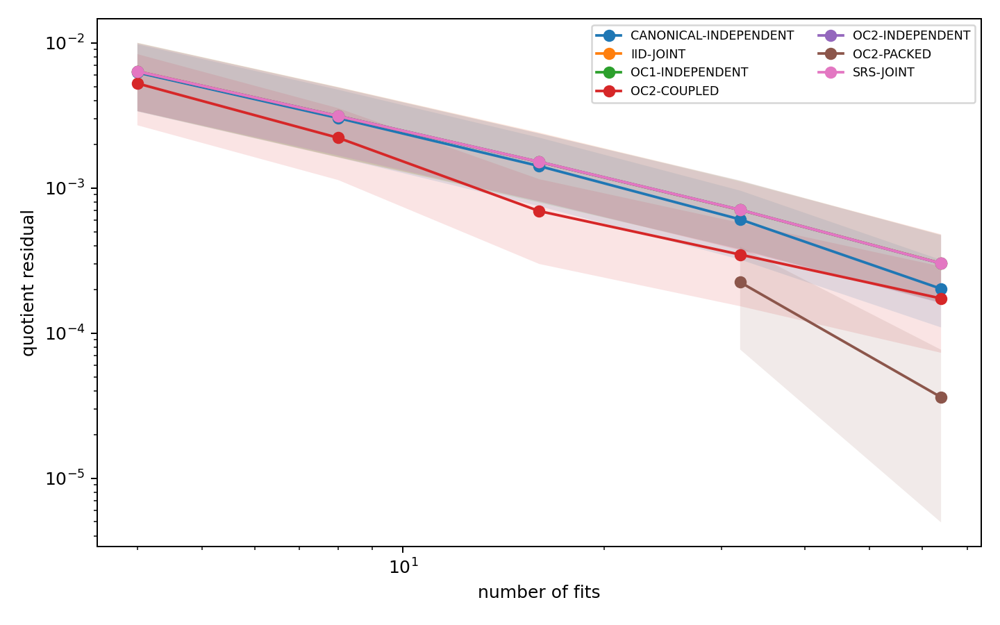
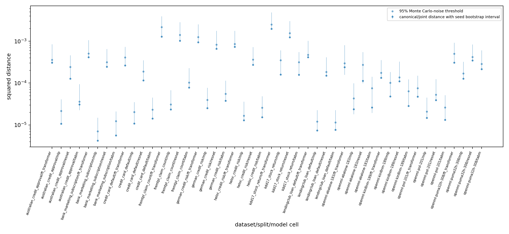
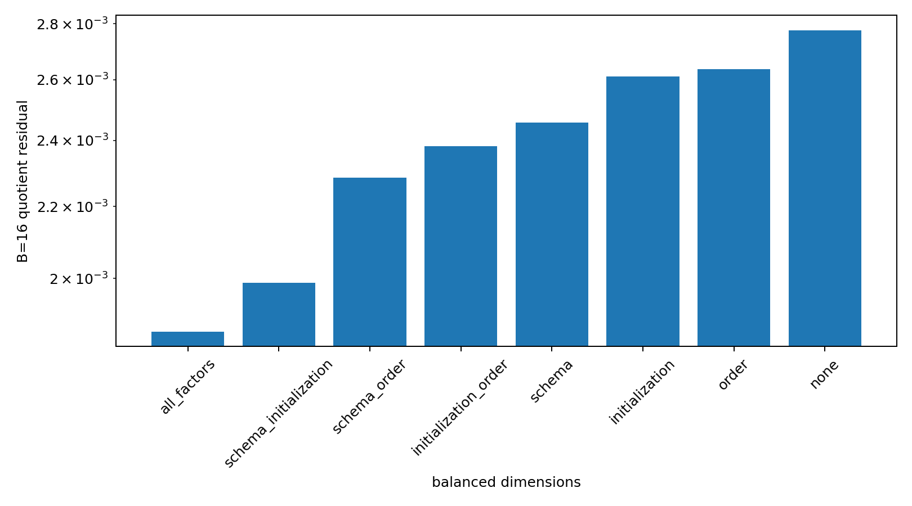
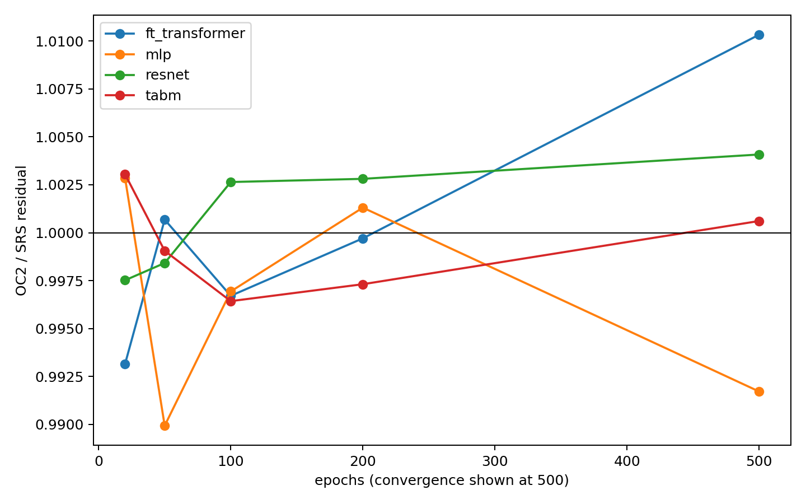
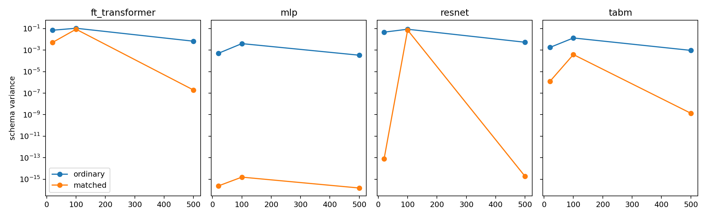

# OrbitCover: Interaction-Balanced Estimation of Semantic Predictor Quotients

Anonymous authors  
Paper under double-blind review

## Abstract

Two tables can encode the same supervised problem while differing only in
feature order, opaque category identifiers, or target identifiers. A learning
pipeline need not return the same predictor on these equivalent
representations, and ordinary seed ensembling does not integrate over this
larger nuisance space. We formulate the output of a randomized learning
pipeline as a vector-valued function on a declared finite product of semantic
symmetries and training randomness. Its orbit average is a *quotient
predictor*. For Brier and squared loss, prediction variance around this
quotient is exactly the expected finite-ensemble loss overhead. A product
functional-ANOVA (fANOVA) decomposition then makes the source of this overhead
observable. OrbitCover applies randomized mixed-level orthogonal arrays to the
complete train-and-predict pipeline: a strength-\(t\) design cancels every
fANOVA component of order at most \(t\), while retaining the correct one-factor
marginals.

We evaluate 12 tabular datasets, three splits, and four neural architectures
(MLP, ResNet, FT-Transformer, and TabM), for 144 primary
dataset × split × architecture cells. In the frozen B=16 comparison,
the fully coupled strength-2 construction has lower estimator residual than a
canonical representation with independent training randomness in 144/144
cells and 12/12 datasets, with a dataset-balanced reduction of 55.9% and a
dataset-clustered 95% interval of [38.7%, 73.8%]. This comparison intentionally
does not assume the two methods share an estimand: their squared expectation
distance is \(2.63\times10^{-4}\) on average and exceeds a cell-specific Monte Carlo
threshold in 10/144 cells. A same-target ablation over 48 independently
specified cells attributes a 47.6% reduction to jointly balancing schema,
initialization, and training order. Fresh independent randomness removes the
benefit of schema-only pair balance (-7.0% versus canonical independent), and
the strength-2 advantage over simple random sampling vanishes on average at
convergence (residual ratio 1.002). Thus OrbitCover is not a universal better
ensemble. It is an auditable estimator for a declared semantic quotient whose
benefit comes from low-order coupling and whose expectation and convergence
boundaries must be reported.

## 1. Introduction

Tabular models receive an array, but users intend a statistical problem.
Reordering feature blocks, renaming opaque categories bijectively, or swapping
class identifiers together with their decoding leaves that problem unchanged.
The implementation path is less abstract: positional parameters, random
initialization, batching, dropout, and finite optimization can couple to the
chosen representation. This gap creates *semantic nuisance variation*: two
legitimate executions of the same declared learning procedure can produce
different aligned predictions.

Recent tabular research has made models stronger, larger, and more
context-aware. TabM studies parameter-efficient neural ensembling [1];
TabPFN-v2 performs in-context prediction with a learned prior [2]; TabDPT [3]
and TabSTAR [4] further develop foundation-style tabular prediction; TabReD
emphasizes realistic temporal drift [5]; and TabArena broadens reproducible
evaluation [6]. These advances make a basic evaluation question more—not
less—important: *which randomized predictor is a reported score intended to
describe?* Averaging several seeds of one canonical encoding targets only one
slice of the possible pipeline. Averaging arbitrary schema transformations is
also incomplete unless outputs are semantically aligned and the sampling law
is declared.

We define the target first. Given a finite nuisance product \(\Omega\) and a
complete training pipeline \(A\), we align every prediction to the same output
coordinates and define the quotient predictor as the expectation over a
declared law on \(\Omega\). The computational problem is then finite-dimensional
integration of an expensive, vector-valued black-box function. Randomized
orthogonal arrays (OAs) are classical variance-reduction designs [7,8]. Our
question is whether their low-order cancellation is useful when the factors
are exact semantic transformations and stochastic choices of an entire neural
training pipeline.

The answer is qualified. Jointly balancing the schema and stochastic factors
can sharply reduce quotient-estimation error at small training budgets. But
balancing schema while drawing a fresh unrelated training RNG does not, and
the relative advantage over sampling without replacement does not survive on
average after convergence. Moreover, symmetrization can change the prediction
target. These negative results are central to the paper: without them, an
apparently universal “structured ensembles beat seed ensembles” story would
be false.

Our contributions are:

1. **A complete-pipeline semantic quotient.** We turn exact representation
   equivalences and training randomness into an explicit product estimand,
   with semantic output alignment and separate canonical, independent-joint,
   and finite-coupled targets.
2. **Exact prediction-space accounting.** We connect Brier/MSE overhead to
   Hilbert variance and decompose the full prediction tensor by product
   fANOVA. A strength-\(t\) randomized OA exactly removes all components of order
   at most \(t\); unmatched interactions and design covariance determine the
   remainder.
3. **A broad falsificatory evaluation.** A prospectively frozen closure covers
   12 datasets, three splits, four neural architectures, independent
   full-pipeline seeds, realistic training sizes and optimization budgets,
   matched-function controls, and a same-target coupling ablation.
4. **An explicit boundary map.** Coupled OrbitCover wins the small-budget
   experiment, but schema balance with fresh RNG fails, target shift is
   measurable, convergence erases the mean SRS advantage, and validation
   stabilization barely changes held-out selection regret.

We do not claim novelty for orthogonal arrays, fANOVA, group averaging, or
antithetic sampling. The proposed contribution is their composition into an
aligned, auditable estimand for complete learning pipelines, together with
evidence that separates the target effect from the coupling effect.

## 2. Semantic nuisance quotients

### 2.1 Setup

Let D=(X,y) be a training sample and x a fixed evaluation sample. Let

\[
  \Omega=\Omega_1\times\cdots\times\Omega_d
\]

be a finite product of declared nuisance factors. In our main experiments the
schema factors are feature-block order, within-field category-ID maps, and
target-ID maps; stochastic factors control initialization and training order.
Every \(z\in\Omega\) preserves the supervised problem. Let
\(P_z(x)=\operatorname{Align}(A(zD;z),zx)\) be the vector of predictions after mapping rows,
classes, and regression scale back to canonical coordinates. For a declared
probability measure \(\mu\) on \(\Omega\), define

\[
  Q_\mu(x)=\mathbb E_{Z\sim\mu}[P_Z(x)].
\]

This definition is distribution-relative. A canonical seed ensemble, a
schema × fresh-seed ensemble, and a finite coupled
schema × initialization × order product need not have the same
expectation. We therefore write \(Q_{\rm can}\), \(Q_{\rm joint}\), and
\(Q_{\rm cpl}\) and report
cross-target distances rather than assuming equality.

### 2.2 Quadratic-loss identity

Equip aligned prediction arrays with the mean rowwise Euclidean inner
product. For one-hot labels Y and Brier loss, or real-valued labels and
squared loss,

\[
 \mathbb E_Z\lVert Y-P_Z\rVert^2
 =\lVert Y-Q_\mu\rVert^2
  +\mathbb E_Z\lVert P_Z-Q_\mu\rVert^2. \tag{1}
\]

The cross term vanishes because \(\mathbb E[P_Z-Q_\mu]=0\). Thus the second term is
both quotient-estimation variance and the exact expected member-loss overhead
under the quadratic score. It is not necessarily large relative to total
predictive loss, and (1) does not imply an accuracy or AUROC improvement.

### 2.3 Product fANOVA

Under a product measure, write the centered prediction field as

\[
  P_z-Q_\mu=\sum_{\emptyset\ne u\subseteq[d]} f_u(z_u),
  \qquad \mathbb E\langle f_u,f_v\rangle=0\quad(u\ne v).
\]

Let \(V_u=\mathbb E\lVert f_u\rVert^2\). Then the total quotient variance is exactly
\(\sum_u V_u\). Unlike one-factor perturbation cards, this decomposition
retains schema × RNG and higher-order interactions.

## 3. OrbitCover

### 3.1 An interaction-balanced estimator

A budget-B design D=(Z_1,...,Z_B) estimates the quotient by

\[
  \widehat Q_D=\frac1B\sum_{b=1}^{B}P_{Z_b}.
\]

OrbitCover constructs D as a randomized mixed-level OA over the declared
factors. Level-label randomization makes every design row marginally correct,
so \(\mathbb E_D[\widehat Q_D]=Q_\mu\) for its finite target. If the array has strength \(t\),
every combination of levels appears equally often in every projection of at
most t factors. It therefore cancels all fANOVA components f_u with |u|<=t.

More generally, let W_D be the random weight vector placed on the finite
product, u the uniform weight vector, C=E[(W_D-u)(W_D-u)^T], and Pi_u the
projector onto fANOVA contrast subspace u. For independently randomized factor
labels, C is scalar on each such subspace and

\[
  \mathbb E_D\lVert\widehat Q_D-Q_\mu\rVert^2
  =\sum_{u\ne\emptyset}\lambda_uV_u,
  \qquad
  \lambda_u=\frac{|\Omega|\operatorname{tr}(C\Pi_u)}{
  \operatorname{rank}(\Pi_u)}. \tag{2}
\]

For IID draws \(\lambda_u=1/B\). A strength-\(t\) array has \(\lambda_u=0\) for
\(|u|\leq t\). Equation (2) is an exact finite-product specialization of classical
randomized-OA integration; it predicts failure whenever unmatched
higher-order energy or adverse covariance dominates.

### 3.2 Coupling is part of the method

There are two different ways to combine schema balance with training
randomness:

- **OC2-independent** balances the schema projection but assigns every fit a
  fresh, otherwise unrelated master seed.
- **OC2-coupled** includes schema, initialization, and data-order factors in
  the strength-2 construction.

Only the second cancels their pairwise interaction components. This distinction
is essential empirically. Coupling is not a bookkeeping convenience and the
two variants may target different randomized procedures.

### 3.3 Scope of the guarantees

Equations (1)–(2) guarantee unbiasedness for the declared finite target and
describe estimator variance. They do not guarantee that a realized cover is
invariant, that its quotient is more accurate than a canonical predictor, or
that strength 2 beats simple random sampling in every field. Nor do they
identify the right nuisance distribution for deployment. These are empirical
and modeling questions.

## 4. Experimental design

### 4.1 Frozen protocol and endpoints

All primary analyses were specified before final-closure outcomes. The
protocol, configuration, hashes, deviations, manifests, and regeneration
commands accompany the submission. Classification uses Brier residual in
aligned probability space; regression uses standardized prediction MSE.
Estimator residual E||Qhat-Q||^2 is primary. Cached resampling draws are
used only to estimate conditional expectations; datasets—not overlapping
draws, rows, or representatives—are the inferential unit. Headline intervals
are 10,000-replicate dataset-clustered bootstraps.

### 4.2 Datasets and models

The primary panel contains six classification datasets (Australian Credit,
Bank Marketing, Credit Card Default, German Credit, HELOC, and LendingClub)
and six regression datasets (FREMtpl Claim Count, KDD17 Stock Return, Abalone,
Kin8nm, Pol, and Puma32H), each under three deterministic splits. Training,
validation, and test samples are capped at 2,048/512/512 in Experiment A. We
evaluate MLP, ResNet, FT-Transformer, and TabM, producing 144 primary cells.
CatBoost and XGBoost are secondary first-split checks and do not enter the
neural aggregate.

### 4.3 Nuisance actions and randomness

Schema actions combine four feature-block orders, up to four valid
within-field category maps, and two target-ID maps for binary classification
(one for regression). A unique signed 63-bit master seed is domain-separated
by SHA-256 into initialization, dataloader, dropout, worker, preprocessing,
and model-operation sub-seeds. Independent pools contain no repeated master
seed within an estimator or cell.

For each cell, the canonical reference averages 128 independent fits. The
independent joint reference averages eight independent predictions per schema
action, giving 512 regression or 1,024 classification fits. The coupled
reference exhausts the declared finite schema × initialization × order
product. At B in {4,8,16,32,64}, we compare canonical independent ensembling,
IID joint sampling, schema sampling without replacement (SRS), strength-1 and
strength-2 independent covers, and the fully coupled strength-2 cover.

### 4.4 Mechanism and convergence controls

A same-target 48-cell ablation crosses four datasets, four architectures, and
three splits. It balances none, each factor alone, every factor pair, or all
schema × initialization × order factors, always measuring residual
to the same exact finite quotient.

A separate six-dataset panel varies nested training size from 2,048 to the
largest feasible sample and optimization from 20 to 200 epochs plus validation
early-stopped convergence. At mandatory small/largest and 20/convergence
corners, exact nuisance products estimate total variance, interaction order,
and OC2/SRS. A matched-function control transforms parameters so that
semantically equivalent models agree initially to at most 10^-6, separating
initial function differences from subsequent optimizer-path effects.

## 5. Results

### 5.1 Coupled OrbitCover is highly efficient at B=16

At \(B=16\), OC2-coupled has lower residual than canonical-independent in 144/144
cells and all 12 dataset means. The equal-dataset reduction is 55.9%, the
median cell reduction is 72.4%, and the dataset-clustered 95% interval is
[38.7%, 73.8%]. Reductions by architecture are 93.2% for MLP, 58.1% for
ResNet, 39.1% for FT-Transformer, and 90.2% for TabM.

| Method | Mean method-relative residual | Ratio to canonical residual | Cell wins vs canonical |
| --- | ---: | ---: | ---: |
| OC2-coupled | 0.000693 | 0.490 | 144/144 |
| Canonical-independent | 0.001415 | 1.000 | — |
| OC1-independent | 0.001512 | 1.068 | 7/144 |
| IID-joint | 0.001513 | 1.069 | 2/144 |
| OC2-independent | 0.001514 | 1.070 | 5/144 |
| SRS-joint | 0.001514 | 1.070 | 7/144 |

The first numeric column measures each method against its declared reference;
it is therefore a computational comparison, not a same-estimand risk table.

This is a comparison of method-relative residuals, not evidence that the two
estimands coincide. The mean squared distance between canonical and
schema × independent expectations is \(2.632\times10^{-4}\) (median
\(1.005\times10^{-4}\)), exceeding the cell-specific 95% Monte Carlo threshold
in 10/144 cells. The finite coupled target is farther from the canonical target
on average (\(2.494\times10^{-3}\)). OrbitCover both changes what is averaged and
changes how efficiently that average is estimated.

### 5.2 Fresh independent RNG eliminates the schema-only advantage

OC2-independent beats canonical-independent in only 5/144 cells and 0/12
dataset means. Its equal-dataset reduction is -7.0%, with a 95% interval of
[-7.8%, -6.3%]. By contrast, OC2-coupled is 58.8% lower than
OC2-independent in the method-relative comparison and wins all 144 cells.
The ablation supplies the same-target explanation: relative to no balance,
all-factor strength-2 balancing has a mean cellwise residual reduction of
47.6% and wins 48/48
cells. Schema alone reduces it by 13.0%, initialization alone by 7.0%, and the
schema × initialization pair by 34.0%; the lowest residual occurs when all
factors are balanced.

The prediction-space fANOVA supports this mechanism. In the audited ablation
tensor, schema × initialization mass (0.01390) is larger than schema-only
mass (0.00481), and joint higher-order mass (0.01155) is also material.
Consequently, “balance schema and spend the rest on arbitrary seeds” is not an
equivalent implementation of OrbitCover.

### 5.3 The advantage is a finite-budget, interaction-dependent effect

At convergence, the mean OC2/SRS residual ratio is 1.002, so the strength-2
advantage does not persist on average. Nuisance variance remains nonzero in
every convergence cell, but its interaction spectrum and the useful coupling
change with architecture and training. The main+pair fraction is only weakly
associated with gain (Spearman rho=0.139, clustered interval
[-0.017, 0.320]); higher-order fraction has rho=0.258 [0.038, 0.415]. These
results reject a simple monotone rule that strength 2 helps precisely when
low-order mass is high.

The complete failure inventory is retained. Strength 3 recovers none of the
seven previously identified strength-2/SRS losses for which the comparison is
available. FT-Transformer is the most difficult primary architecture: it has
the weakest B=16 coupled reduction (39.1%) and the largest ordinary exact-match
residual.

### 5.4 Exact function matching narrows the optimizer-path claim

Under exact transformed initialization, residual variance is effectively zero
for MLP (8.97 × 10^-16) and ResNet (8.41 × 10^-14), but remains
0.00262 for FT-Transformer and 4.19 × 10^-6 for TabM in the initial
matched study. At convergence, matched residual falls to 1.96 × 10^-7
for FT-Transformer and 1.35 × 10^-9 for TabM. Thus schema does not
universally induce irreducible optimizer-path divergence. Architecture-specific
tokenization, member structure, dropout, and minibatch dynamics remain the
supported scope.

### 5.5 Better quotient estimation is not the same as better model selection

Earlier exact validation experiments improved strength-2 winner agreement
from 96.69% for IID to 99.41%, and rank correlation from 96.77% to 98.64%.
Yet exact validation and test winners agree in only 19/36 partitions. Held-out
selected-test regret changes only from 0.005029 to 0.004906. Partition shift
therefore dominates the remaining selection error; this paper does not claim
a practically meaningful test-performance gain.

### 5.6 Secondary scope and compute

For first-split classical controls, independent strength-2 balance reduces
residual by 16.2% for CatBoost (7/12 cell wins) and 61.6% for XGBoost (12/12),
although near-deterministic cells make relative ratios fragile. The complete
audited registry contains 140,592 unique fits and 232.0 summed local fit-hours
(231.8 GPU, 0.2 CPU). These numbers document reproducibility, not a portable
wall-clock speedup.

## 6. Related work

**Tabular neural models and evaluation.** TabM [1] demonstrates that efficient
ensembling is a strong tabular baseline; our comparison concerns which
nuisance distribution an ensemble integrates. TabPFN-v2 [2], TabDPT [3], and
TabSTAR [4] learn increasingly broad tabular priors or representations.
TabArena [6], TabReD [5], and temporal model-selection work [9] emphasize
reproducible, realistic evaluation. OrbitCover addresses orthogonal variation
inside a fixed train/evaluation split and does not solve temporal or
population shift.

**Symmetrization and multiplicity.** Metamorphic testing already treats
attribute and class-label permutations as valid supervised transformations
[10]. Frame averaging [11] and learned probabilistic symmetrization [12]
reduce or learn group averages for architectures. OrbitCover instead samples
complete retraining pipelines, returns an unbiased estimate rather than an
exactly invariant realized network, and explicitly includes stochastic
training factors. Neural-network multiplicity itself is well established
[13]; our focus is the product estimand and interaction accounting.

**Experimental design and variance reduction.** Randomized OAs and OA-based
Latin hypercubes remove low-order ANOVA terms in numerical integration [7,8].
OAs have also been used to build low-correlation training ensembles [14], and
orthogonal Monte Carlo couples continuous random features [15]. We claim none
of these ingredients. Here every member sees the full training data, OA rows
index semantic and stochastic pipeline actions, vector predictions are aligned
before averaging, and exact/cross-target residuals are audited.

**Stable risk estimation and selection.** Low-variance validation criteria
can reduce selection overfitting [16]. Antithetic cross-validation [17,18]
couples response perturbations and provides strong risk-estimation theory;
this close contemporary work rules out any generic claim that antithetic risk
estimation is new. OrbitCover acts on a finite nuisance product without
perturbing responses or changing train/test membership. Its present empirical
claim is quotient estimation, not universal model-selection improvement.

## 7. Limitations and broader impact

The quotient is only as meaningful as its declared nuisance law. Uniform
averaging over a finite action menu is transparent, but deployment may call
for a nonuniform or robust target. Some schema operations are exact semantic
equivalences only when preprocessing and prediction alignment are implemented
correctly. We audit those invariants but cannot cover unknown implementation
bugs or undeclared transformations.

Our primary evidence is tabular and limited to four neural architectures.
The coupled construction uses a finite initialization/order menu, while the
fresh-RNG comparison targets an independent distribution. The 128-seed
canonical reference and 512/1,024-fit joint references still have Monte Carlo
error. Dataset-clustered intervals describe the 12-source panel and should not
be read as population-free guarantees.

Quadratic prediction-space residual is the endpoint justified by (1).
Accuracy and AUROC can respond differently. A smaller quotient-estimation
residual need not improve predictive accuracy, fairness, calibration, or
robustness to population shift. The validation/test result directly shows
that removing pipeline Monte Carlo is insufficient when partition shift
dominates.

Finally, the benefit is not universal: OC2-independent fails, average OC2/SRS
efficiency vanishes at convergence, strength 3 does not repair the observed
failure panel, and exact function matching nearly closes MLP and ResNet. These
are not implementation footnotes; they delimit when the method should be used.

The broader-impact risk is primarily evaluation misinterpretation. Reporting
an apparently stable quotient without stating its transformation law can hide
meaningful model multiplicity. Conversely, treating all representation
variation as instability can waste compute on irrelevant factors. We recommend
publishing the action menu, alignment checks, cross-target distances, residual
curve, and all failure cells with any OrbitCover result.

## 8. Conclusion

A model score is incomplete unless the randomized pipeline it averages is
specified. OrbitCover makes exact tabular representation equivalences and
training randomness into a finite semantic quotient, decomposes its
prediction-space variance, and uses interaction-balanced designs to estimate
that quotient. Across 144 neural cells, a coupled strength-2 construction is
substantially more efficient at B=16, and a same-target ablation traces the
gain to joint schema/RNG balance. The same experiments also show why the claim
must remain narrow: fresh-RNG schema balance fails, expectations can change,
convergence erases the mean advantage over simple random sampling, and better
validation fidelity barely changes held-out selection. The practical lesson
is therefore conditional: design the randomization around the interactions of
the *declared* pipeline, and audit both the target and the finite-budget
benefit.

## References

[1] Gorishniy et al. “TabM: Advancing Tabular Deep Learning with
Parameter-Efficient Ensembling.” ICLR 2025.
https://proceedings.iclr.cc/paper_files/paper/2025/hash/c1ba41c694834aeef91ae161711d4939-Abstract-Conference.html

[2] Hollmann et al. “Accurate Predictions on Small Data with a Tabular
Foundation Model.” Nature, 2025.
https://www.nature.com/articles/s41586-024-08328-6

[3] Ma et al. “TabDPT: Scaling Tabular Foundation Models on Real Data.”
NeurIPS 2025.
https://proceedings.neurips.cc/paper_files/paper/2025/hash/fc0e3f908a2116ba529ad0a1530a3675-Abstract-Conference.html

[4] Arazi, Shapira, and Reichart. “TabSTAR: A Tabular Foundation Model for
Tabular Data with Text Fields.” NeurIPS 2025.
https://proceedings.neurips.cc/paper_files/paper/2025/hash/faf6e23e198314c7728eaa6ac44ae079-Abstract-Conference.html

[5] Rubachev et al. “TabReD: Analyzing Pitfalls and Filling the Gaps in
Tabular Deep Learning Benchmarks.” ICLR 2025.
https://proceedings.iclr.cc/paper_files/paper/2025/hash/571799482291411607c54984153190b0-Abstract-Conference.html

[6] Erickson et al. “TabArena: A Living Benchmark for Machine Learning on
Tabular Data.” NeurIPS 2025 Datasets and Benchmarks Track.
https://proceedings.neurips.cc/paper_files/paper/2025/hash/1697e3fb412da11dc9488249f9e7bbc9-Abstract-Datasets_and_Benchmarks_Track.html

[7] Owen. “Orthogonal Arrays for Computer Experiments, Integration and
Visualization.” Statistica Sinica, 1992.
https://www3.stat.sinica.edu.tw/statistica/j2n2/j2n27/j2n27.htm

[8] Ai, Kong, and Li. “A General Theory for Orthogonal Array Based Latin
Hypercube Sampling.” Statistica Sinica, 2016.
https://www3.stat.sinica.edu.tw/statistica/j26n2/j26n217/j26n217.html

[9] Han et al. “Temporal Model Selection for Time-varying Data.” ICML 2024.
https://proceedings.mlr.press/v235/han24b.html

[10] Xie et al. “Application of Metamorphic Testing to Supervised
Classifiers.” 2011.
https://pmc.ncbi.nlm.nih.gov/articles/PMC3019603/

[11] Puny et al. “Frame Averaging for Invariant and Equivariant Network
Design.” ICLR 2022. https://openreview.net/forum?id=zIUyj55nXR

[12] Kim et al. “Probabilistic Symmetrization for Learning with Group
Actions.” NeurIPS 2023.
https://proceedings.neurips.cc/paper_files/paper/2023/hash/3b5c7c9c5c7bd77eb73d0baec7a07165-Abstract-Conference.html

[13] Summers and Dinneen. “Nondeterminism and Instability in Neural Network
Optimization.” ICML 2021. https://proceedings.mlr.press/v139/summers21a.html

[14] Johnson and Broatch. “On Ensembles, I-Optimality, and Active Learning.”
Journal of Data Science, Statistics, and Visualisation, 2021.
https://doi.org/10.1007/s42519-021-00200-4

[15] Choromanski et al. “Unifying Orthogonal Monte Carlo Methods.” ICML
2019. https://proceedings.mlr.press/v97/choromanski19a.html

[16] Cawley and Talbot. “On Over-fitting in Model Selection and Subsequent
Selection Bias in Performance Evaluation.” JMLR, 2010.
https://jmlr.org/papers/v11/cawley10a.html

[17] Liu, Panigrahi, and Soloff. “Cross-validation with antithetic Gaussian
randomization.” JRSS-B, 2026. https://doi.org/10.1093/jrsssb/qkag073

[18] Chattopadhyay, Liu, and Panigrahi. “On the optimality of antithetic
randomization for cross-validation.” 2026. https://arxiv.org/abs/2608.08089
