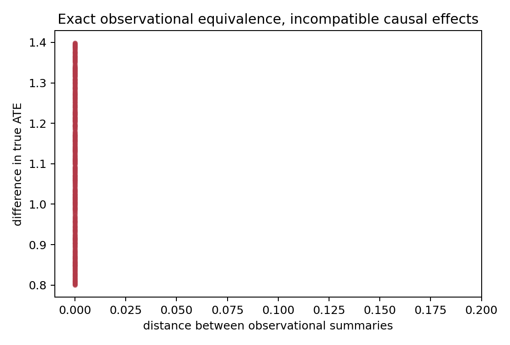
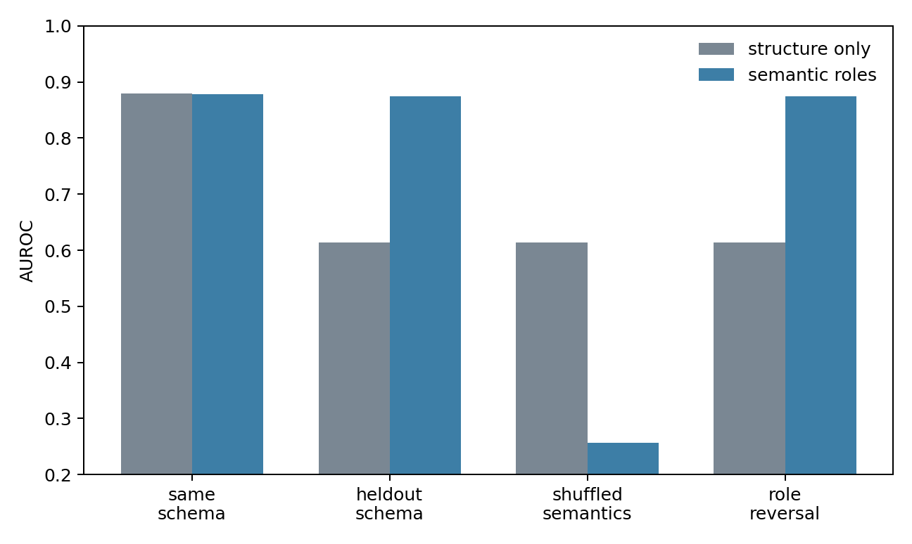
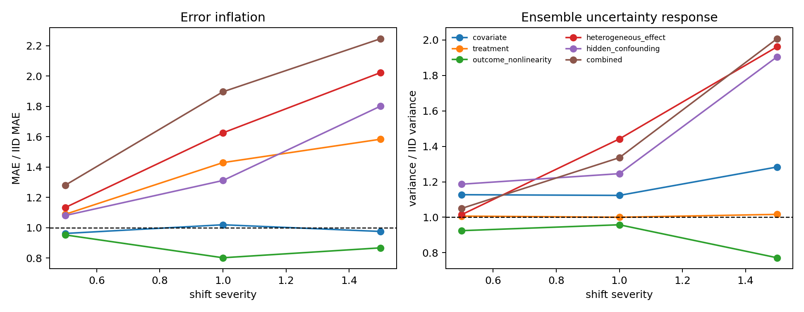

# Rapid Tabular-AI Research Sweep

## Executive conclusion

Best direction: **Identification-aware causal relational foundation models**

Why: Exact observational-equivalence pairs forced every ATE regressor—linear, forest, or neural—to the same irreducible compromise as a constant predictor, while a three-seed neural ensemble showed little disagreement. An identifiability classifier using observations alone remained exactly at AUROC 0.50; adding explicit assumptions raised AUROC and accuracy to 1.00. The discontinuity survived five seeds, three sample sizes, reduced summaries, varied effect gaps, and a separate binary SCM family. This is the clearest epistemic failure in the sweep, although turning a textbook impossibility into a foundation-model contribution remains the main research risk.

Most surprising observation: On held-out schemas, a minimal role-semantic representation improved AUROC from **0.614 ± 0.005** to **0.874 ± 0.002** without improving same-schema AUROC. Fifty target labels essentially erased that advantage.

Biggest concern: The two strongest effects were intentionally constructed. Direction 1 currently demonstrates a causal theorem more than a relational foundation-model failure, and Direction 2 uses an oracle source/destination role vector rather than recovering roles from free text.

The full primary run took 9.8 seconds and the adversarial robustness panel 5.4 seconds on the available host. All three DeepSets models were kept on CPU despite CUDA availability. No external repository or network resource was used, and the recorded exception list is empty.

---

# 1. Identification-Aware Causal Relational Models

## Hypothesis

An observational dataset encoder will return a precise-looking point estimate even when two latent SCMs induce the same observed distribution but imply different interventions. Explicit causal assumptions should change identifiability decisions in a way that observations alone cannot.

## Experiments run

Test 1A generated 700 pairs of linear-Gaussian SCMs. Within each pair, the exact same 160-row observed `(X,Y)` sample is compatible with two explicit hidden-confounding parameterizations. The pair has observational-summary distance zero but an ATE gap sampled from 0.8–1.4. Entire pairs were assigned to either train or test. Ridge, random forest, a small MLP, and a constant baseline predicted ATE from 17 observational summaries.

Test 1B generated 850 observational-equivalence blocks spanning randomized treatment, observed and hidden confounding, valid and invalid IVs, an observed mediator, and collider conditioning. Each block reused its observational sample across assumption scenarios. Logistic, forest, and MLP classifiers received either observational summaries alone or summaries plus a seven-bit assumption vector.

Robustness checks used five data seeds, sample sizes 32/160/512, three ATE-gap scales, a three-statistic reduced-capacity representation, and an alternative binary SCM family. In that family, a randomized causal world and a purely confounded world have the same observed `(X,Y)` law under three outcome-noise levels. Assumption metadata was also randomly permuted as a negative control.

## Results

| experiment | baseline | proposed / learned | effect |
|---|---:|---:|---:|
| ATE from exactly equivalent observations, MAE | constant 0.550 | ridge 0.550; RF 0.550; MLP 0.553 | no learned model beats the compromise |
| ATE neural ensemble | MAE lower bound ≈ 0.553 | MAE 0.550; mean variance 0.025 | models agree while remaining causally wrong for each paired world |
| Identifiability, observations only | majority accuracy 0.571 | logistic accuracy 0.571, AUROC 0.500 | no signal beyond class balance |
| Identifiability, plus assumptions | majority accuracy 0.571 | logistic accuracy/AUROC 1.000/1.000 | +42.9 accuracy points |
| Shuffled-assumption control, five seeds | real metadata AUROC 1.000 ± 0.000 | shuffled AUROC 0.481 | gain disappears under permutation |
| Binary alternative SCM | theoretical half-gap MAE 0.15–0.45 | ridge MAE exactly 0.15–0.45 | impossibility survives family and sample size |

The full, three-statistic ridge, and constant models had identical MAE in every continuous robustness cell. Increasing sample size from 32 to 512 did not help: with exact observational equivalence, more observational data only estimates the shared distribution more accurately.

## Key figure

The vertical stack at zero observational distance is intentional, not a plotting artifact: each point is one pair of causal worlds sharing the exact same observed sample.

## Interpretation

The point-estimation objective is malformed on these tasks. The correct output is not a better scalar ATE but an assumption-conditional set of effects or an explicit `NOT_IDENTIFIABLE` decision. The low cross-seed prediction variance is especially relevant: ordinary ensemble agreement does not represent ambiguity that is shared by every model trained on the same incomplete information.

The assumption classifier is not evidence that a neural model discovered causal identification. It shows the narrower and useful point that identification requires causal assumptions to be represented as inputs rather than inferred from an observational equivalence class.

## Failure modes / caveats

- Exact equivalence is deliberately adversarial and follows elementary causal theory.
- The learned models operate on summary vectors, not raw relational tables or a pretrained foundation model.
- Test 1B makes assumption scenarios exactly observationally equivalent; real datasets may contain correlates of study design, but those correlates are not proofs of identification.
- The optional cross-schema relational experiment was not run. A paper claim about relational transfer is therefore unsupported.
- Ensemble variance is an informal confidence proxy here, not a calibrated posterior over SCMs.

## Scores and next experiment

- Empirical signal: **5/5**
- Novelty potential: **3/5**
- Tractability: **5/5**
- Scientific depth: **5/5**
- Probability deeper experiments reveal something publishable: **55%**
- Recommended next experiment: train an abstaining or set-valued dataset encoder across mixed SCM families, then test held-out graph motifs and relational schemas under approximate observational equivalence.

## Verdict

**PURSUE**

---

# 2. Semantics-Aware Relational Pretraining

## Hypothesis

An arbitrary schema-ID representation can fit familiar schemas but cannot infer which unseen field is the source versus destination of a directional relation. An explicit role representation should transfer without helping much on IID rows from known schemas.

## Experiments run

Six source schemas and four target schemas used disjoint domain and field names. The outcome depended on `+2 × source risk − 1 × destination risk`; physical column order alternated across schemas. The structure-only model received numeric values plus arbitrary source-schema IDs. The semantic model used the identical logistic downstream model and added the protocol's final-fallback manual source/destination role vector and value-role interactions.

Fresh same-schema rows, entirely held-out schemas, permuted semantics, paired physical role reversals, and 0/10/50/100-label target adaptation were evaluated over three seeds. Five-seed robustness then varied source-schema rows (100/500/1,400) and signal strength (0.5/1.0/1.5). An alternative regression DGP varied outcome-noise standard deviation (0.5/1.0/2.0).

## Results

| experiment | structure only | semantic roles | effect |
|---|---:|---:|---:|
| Fresh rows, known schemas, AUROC | 0.880 ± 0.006 | 0.879 ± 0.003 | −0.1 point; no IID capacity gain |
| Held-out schemas, AUROC | 0.614 ± 0.005 | 0.874 ± 0.002 | **+26.0 points** |
| Held-out accuracy | 0.580 ± 0.005 | 0.789 ± 0.003 | +20.9 points |
| Shuffled semantics, AUROC | 0.614 ± 0.005 | 0.256 ± 0.005 | semantic model follows the wrong roles |
| Zero-shot medicine, AUROC | 0.617 ± 0.004 | 0.874 ± 0.007 | +25.7 points |
| 50-shot medicine, AUROC | 0.863 ± 0.007 | 0.872 ± 0.008 | advantage shrinks to 0.9 point |
| Robustness panel, AUROC | 0.612 overall | 0.850 overall | survives all size/signal cells |
| Alternative regression, RMSE at noise 0.5 | 2.208 ± 0.044 | 1.193 ± 0.021 | 46% reduction |
| Alternative regression, RMSE at noise 2.0 | 2.943 ± 0.021 | 2.274 ± 0.018 | 23% reduction |

At 10 shots, the target-only semantic refit was unstable (0.667 ± 0.361), while the positional model reached 0.850 ± 0.023. This failed run is retained rather than smoothed away. By 50–100 labels, both models were near 0.86–0.87 AUROC.

## Key figure

The intended signature appears: known-schema performance is essentially tied, while the gap opens only on unseen schemas. Permuting semantic roles reverses the signal rather than leaving performance unchanged.

## Interpretation

Correct role information is highly valuable for zero-shot schema transfer and does not act merely as extra IID capacity. However, this experiment establishes an upper bound on the value of role semantics, not a result about natural-language embeddings. The manual vector directly supplies the fact that a doctor is the source and a patient the destination.

The separate role-reversal test did not produce a new qualitative failure: semantic AUROC stayed at 0.874, but structure-only AUROC also stayed near its already weak 0.614. The positive result is therefore held-schema transfer, not unique reversal robustness.

## Failure modes / caveats

- Manual role vectors are an oracle and bypass the hard semantic-grounding problem.
- Schema names are synthetic; there is no real relational dataset validation.
- Few target labels erase most of the zero-shot advantage.
- A lexical model could exploit domain conventions or fail on ambiguous/polysemous roles; neither case was tested.
- The regression semantic model did not reach its noise floor, partly because raw positional features share coefficients with the canonical features.

## Scores and next experiment

- Empirical signal: **4/5**
- Novelty potential: **3/5**
- Tractability: **4/5**
- Scientific depth: **4/5**
- Probability deeper experiments reveal something publishable: **45%**
- Recommended next experiment: replace oracle roles with frozen text embeddings and evaluate compositional synonyms, ambiguous names, and paraphrased schema descriptions on unseen synthetic and real schemas.

## Verdict

**MAYBE**

---

# 3. Prior Misspecification and Calibration

## Hypothesis

A small amortized ATE estimator can become confidently wrong outside its training prior, while an external distance-to-prior score may anticipate failures better than ensemble disagreement.

## Experiments run

Three 2,001-parameter DeepSets models encoded rows `(X,T,Y)`, mean-pooled 32-dimensional row representations, and predicted dataset-level ATE. Each trained for 360 CPU steps on linear-Gaussian tasks with 96 rows. Evaluation covered IID plus covariate, propensity, outcome, heterogeneous-effect, hidden-confounding, and combined shifts at three severities, with 220 tasks per cell.

An Isolation Forest was fit only to unlabeled summaries from 2,200 IID-prior datasets. A separate 600-task IID calibration set froze the 90% interval scale and bad-error threshold. A raw treated-minus-control estimate was retained as the deliberately stupid baseline.

## Results

| experiment | IID | shifted | effect |
|---|---:|---:|---:|
| DeepSets MAE across model seeds | 0.198 ± 0.003 | combined-1.5: 0.442 ± 0.001 | 2.25× ensemble-mean error |
| Ensemble variance | 0.000572 | combined-1.5: 0.001149 | 2.01×; uncertainty does react |
| Treatment shift severity 1.5 | MAE 0.196 | MAE 0.311 | 1.58× error with only 1.6% variance growth |
| Heterogeneous effect severity 1.5 | MAE 0.196 | MAE 0.397 | 2.02× error, but 1.96× variance |
| Error detection AUROC | — | ensemble 0.545; OOD 0.683; combined 0.661 | prior distance is better, not strong |
| Spearman with absolute error | — | uncertainty 0.080; OOD 0.264 | modest monotonic signal |
| Calibrated 90% coverage | IID 0.868 | combined-1.5: 0.714 | undercoverage under shift |

Outcome nonlinearity was a negative result: at severity 1.0 it reduced MAE to 0.157 rather than causing failure. Covariate shift was also mostly benign. Hidden confounding raised MAE 1.80× at severity 1.5, but ensemble variance rose 1.91×.

## Key figure

## Interpretation

The toy learner does fail under several shifts, and the external detector outperforms ensemble variance for identifying high-error tasks. But the preregistered strong signature did not appear: every shift exceeding 2× IID error also raised uncertainty far more than the allowed 25%, and OOD/error Spearman correlation was 0.264 rather than greater than 0.5. The treatment shift offers a weaker confidently-wrong pattern, but its error increase is only 1.58×.

## Failure modes / caveats

- The model is a toy amortized learner, not TabPFN or a causal foundation model.
- Three networks are too few for a strong uncertainty conclusion.
- Isolation-Forest score quality depends on hand-built summaries.
- Shift severities are synthetic and not calibrated to realistic deployment frequencies.
- The combined detector was an unsupervised standardized sum and underperformed OOD score alone.
- No cross-family held-out detector evaluation was performed.

## Scores and next experiment

- Empirical signal: **3/5**
- Novelty potential: **3/5**
- Tractability: **4/5**
- Scientific depth: **4/5**
- Probability deeper experiments reveal something publishable: **30%**
- Recommended next experiment: only revive this formulation if a new, realistic shift family produces at least 2× IID error with less than 25% uncertainty growth and a detector exceeds 0.8 AUROC on unseen shift families.

## Verdict

**KILL**

---

# Two-hour follow-up

The first two directions were subsequently tested with actual TabPFN models, raw-row set learners, three frozen text encoders, eight lexical resplits, a real three-domain endpoint panel, continuous observational-equivalence pairs, and up to 64 nuisance columns. See [`followup_two_hour/FOLLOWUP_RESULTS.md`](followup_two_hour/FOLLOWUP_RESULTS.md).

The update strengthens the causal non-identification phenomenon but narrows it to a benchmark/stress-testing pivot because closely related partial-identification foundation-model work appeared in August 2026. It weakens the broad schema-semantics direction: TF-IDF beats the frozen encoders in standard synthetic conditions and the small real panel is negative. The ranking below records the original rapid-sweep decision; the follow-up report contains the updated ranking.

# Comparison

| direction | empirical | novelty | tractability | depth | publishability | verdict |
|---|---:|---:|---:|---:|---:|---|
| causal relational | 5 | 3 | 5 | 5 | 55% | PURSUE |
| semantics | 4 | 3 | 4 | 4 | 45% | MAYBE |
| prior shift | 3 | 3 | 4 | 4 | 30% | KILL |

# Recommended next 7-day experiment

## Identification-aware set prediction on unseen SCMs and schemas

**Precise hypothesis.** A dataset encoder trained to output either an ATE interval/set or `NOT_IDENTIFIABLE`, conditioned on explicit graph and assumption tokens, will retain at least 90% coverage on held-out approximately equivalent SCM families. Point-estimate and ensemble baselines will retain narrow intervals while violating coverage.

**Implementation.** Extend the row-encoder/mean-pooling model with graph-motif and assumption-token inputs and two heads: an identification classifier and quantile bounds. Train on randomized, back-door, front-door, valid/invalid IV, hidden-confounding, mediator, and collider families. Include relational customer/order and patient/visit schema renderings with shared abstract graphs but disjoint field names. Do not reward narrow intervals on nonidentified tasks; supervise the sharp identified set computed from the generator.

**Generators.** Use at least four continuous and binary SCM families, including the two exact families in this sweep, approximate-equivalence pairs with finite-sample distribution distance, and held-out graph motifs. Use 10 training seeds, five test seeds, and sample sizes 64/256/1,024.

**Baselines.** Point-estimate DeepSets, the same model with a three-to-five-member ensemble, summary-statistic random forest, standard back-door/IV estimators when their assumptions are supplied, and a constant `NOT_IDENTIFIABLE` baseline.

**Metrics.** Identification AUROC and balanced accuracy; ATE-set coverage and width; false-identification rate; calibration by observational-distance bin; held-out-graph and cross-schema transfer; accuracy conditional on valid assumptions.

**Falsification criterion.** Stop if explicit assumption tokens do not reduce false-identification by at least 20 percentage points on held-out motifs, if 90% set coverage cannot be maintained without always returning vacuous intervals, or if a rule-based graphical-identification baseline matches the learned model on every held-out family.

**Expected compute.** One commodity GPU or CPU parallelism, under 24 GPU-hours or roughly 2–4 CPU-days; no large language model or large transformer training.

# Ranking

1. Identification-aware causal relational foundation models
2. Semantics-aware synthetic pretraining for relational/tabular foundation models
3. Prior misspecification, calibration, and failure detection for amortized causal/tabular models
